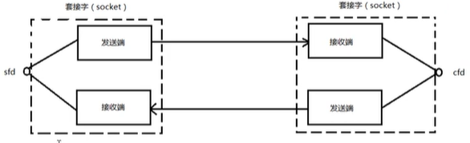
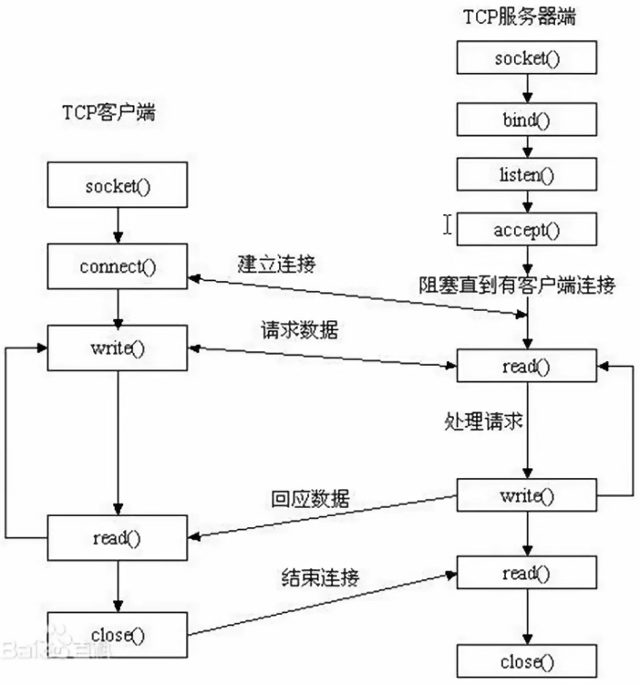

## 1 网络基础

### 1.1 协议的概念

#### 1.1.1 什么是协议

网络传输的规则

#### 1.1.2 典型协议

-   **应用层**：为**特定应用程序**提供**数据传输服务**，例如 HTTP、ftp, ssh, telnet, DNS 等协议。数据单位为报文。
-   **传输层** ：为**进程**提供**通用数据传输服务**。由于应用层协议很多，定义**通用的传输层协议就可以支持不断增多的应用层协议**。运输层包括两种协议：传输控制协议 TCP，提供面向连接、可靠的数据传输服务，数据单位为报文段；**用户数据报协议** UDP，提供无连接、尽最大努力的数据传输服务，数据单位为**用户数据报**。TCP 主要提供完整性服务，UDP 主要提供及时性服务。
-   **网络层** ：为**主机**提供数据传输服务。而传输层协议是为主机中的进程提供数据传输服务。网络层把传输层传递下来的报文段或者用户数据报**封装成分组**。IP 协议，ICMP 协议，IGMP 协议
-   **数据链路层** ：数据链路层针对的还是主机之间的数据传输服务，而**主机之间可以有很多链路**，链路层协议就是为同一链路的主机提供数据传输服务。数据链路层把网络层传下来的分组**封装成帧**。ARP 协议，RARP 协议
-   **物理层** ：考虑的是怎样在**传输媒体**上**传输数据比特流**，而不是指具体的传输媒体。物理层的作用是尽可能屏蔽传输媒体和通信手段的差异，使数据链路层感觉不到这些差异。

### 1.2 网络应用程序设计模式

#### 1.2.1 C/S 模式


#### 1.2.2 B/S 模式


#### 1.2.3 优缺点

用 c/s 模型：缓存大量数据，大量图片，特效等，需要自定义协议，需要安装客户端，更新需要重新安装，安全性较低，不能跨平台。开发工作量较大。

b/s 模型： 必须严格遵守 http 协议。不能缓存大量数据，安全性较高。便于更新服务。跨平台。开发工作量小。

### 1.3 分层模型

### 1.4 通信过程

### 1.5 协议格式

#### 数据包封装

#### 以太网帧格式

#### ARP 数据报格式

#### IP 段格式

#### UDP 数据报格式

包含 16 位源端口号，16 位目的端口号

什么是端口号：在网络的一台主机上唯一的**标识一个进程**

ip 地址 + 端口号，可以在网络中唯一的标识一个进程

8080 : http，一般5000 以下被主机占用，自己设定 5000 以上

#### TCP 数据报格式

包含 16 位源端口号，16 位目的端口号

32 序号 和 32 位确认序号

6 个标志位

16 位窗口大小，65535

### 1.6 TCP 协议

## 2 Socket 编程

### 2.1 套接字概念

在通信过程中，套接字一定是成对出现的。一端的发送缓冲区对应另一端的接收缓冲区。使用同一个文件描述符指向一个套接字（该套接字内部由内核建立的发送缓冲区和接收缓冲区实现）




### 2.2 预备知识

#### 2.2.1 网络字节序

大小端的区别

小端法：主机存储，高位高地址，地位存低地址， int a = 0x12345678

大端法：网络存储，高位存低地址，地位存高地址。

因此需要网络字节序和主机字节序的转换

htonl --> 本地转网络 争对网络（IP）

htos --> 本地转网络 针对 端口

ntohl --> 网络转本地 争对网络（IP）

ntohs --> 网络转本地 针对端口


#### 2.2.2 IP地址转换函数

上面的转换太麻烦，于是有

#include <arpa/inet.h>

本地转网络

```c
   int inet_pton(int af, const char *src, void *dst);
```
网络转本地

```c
const char *inet_ntop(int af, const void *src, char *dst, socklen_t size);
```

#### 2.2.3 sockaddr 数据

sockaddr 地址结构，缺陷是 sa_data 把目标地址和端口信息混在一起了

struct sockaddr {       

​			sa_family_t sin_family;     *//地址族* 　  

​			char sa_data[14];            *//14字节，包含套接字中的目标地址和端口信息*                　 

​					}; 

struct sockaddr_in addr;

```c
struct sockaddr_in
  {
   	sa_family_t sin_family		// 地址簇 
    in_port_t sin_port;          /* Port number. 16 位端口号 */
    struct in_addr sin_addr;      /* Internet address. 32 位 ip 地址 */

    /* Pad to size of `struct sockaddr'.  */
    unsigned char sin_zero[sizeof (struct sockaddr) -
            __SOCKADDR_COMMON_SIZE -
            sizeof (in_port_t) -
            sizeof (struct in_addr)];
  };
```

addr.sin_family = AF_INET/AF_INET6

addr.sin_port = htons(8888)

int dst

addr.sin_addr.s_addr =  inet_pton(AF_INET, "192.168.1.188", (void *)&dst)

bind(fd, (struct sockaddr *)&addr, size);

sockaddr 常用于 bind, connect, recvfrom, sendto 等函数的参数，指明地址信息，是一种通用的套接字地址。

sockaddr_in 是 internet 环境下的套接字的地址形式。所以在网络编程中我们会对 sockaddr_in 结构体进行操作，使用 sockaddr_in 来建立所需要的信息，最后使用类型转换就可以了。一般先把 sockaddr_in 变量赋值后，强制类型转换后传入 sockaddr 做参数的函数。sockaddr_in 用于 socket 的定义和赋值，sockaddr 用于函数参数。

```c
// set local address info
sock_addr.sin_family = AF_INET;
sock_addr.sin_port = htons(port);  // 本地字节序转网络字节序，16位 所以为 htons ,s 表示 short
sock_addr.sin_addr.s_addr = htonl(INADDR_ANY);    //
```

INADDR_ANY 转换过来就是0.0.0.0，泛指本机的意思，也就是表示本机的所有IP，因为有些机子不止一块网卡，多网卡的情况下，这个就表示所有网卡ip地址的意思。比如一台电脑有3块网卡，分别连接三个网络，那么这台电脑就有3个ip地址了，如果某个应用程序需要监听某个端口，那他要监听哪个网卡地址的端口呢？

如果绑定某个具体的ip地址，你只能监听你所设置的ip地址所在的网卡的端口，其它两块网卡无法监听端口，如果我需要三个网卡都监听，那就需要绑定3个ip，也就等于需要管理3个套接字进行数据交换，这样岂不是很繁琐？

所以出现INADDR_ANY，你只需绑定INADDR_ANY，管理一个套接字就行，不管数据是从哪个网卡过来的，只要是绑定的端口号过来的数据，都可以接收到。

### 2.3 网络套接字函数



socket建立过程需要三个套接字，服务端有两个，还有一个用于监听。


#### 2.3.1 socket

#include <sys/socket.h>

int socket(int domain, int type, int protocol);

详见 man 2 socket

##### 参数

-   domain 选择用来通信的协议簇
    -   AF_INET：ipv4
    -   AF_INET6：ipv6
    -    AF_UNIX: 本地通信
-   type 指定通信语义，常用的如下：
    -   SOCK_STREAM：提供顺序的、可靠的、双向的、基于连接的字节流。可能支持带外数据传输机制。就是 tcp
    -   SOCK_DGRAM：支持数据报(固定最大长度的无连接、不可靠的消息)。就是 udp
-   protocol: 指定与套接字一起使用的特定协议。通常，在给定的协议族中，只有一个协议支持特定的套接字类型，在这种情况下，值设定为 0。

##### 返回值

新套接字对应的文件描述符，失败是 -1 并设置 errno。

#### 2.3.2 setsockopt/getsockopt

设置或获取 sockets 选项

#include <sys/types.h>          /* See NOTES */
       #include <sys/socket.h>

```c
   int getsockopt(int sockfd, int level, int optname,
                  void *optval, socklen_t *optlen);
   int setsockopt(int sockfd, int level, int optname,
                  const void *optval, socklen_t optlen);
```

setsockopt() 函数，用于任意类型、任意状态套接字的设置选项值。尽管在不同协议层上存在选项，但本函数仅定义了最高的“套接口”层次上的选项。

#### 2.3.3 bind

给 socket 绑定一个 ip 加端口号（也就是一个地址结构）

int bind( int sockfd, const struct sockaddr *addr, socklent_t addrlen);

-   sockfd: socket 函数返回值
-   struct sockaddr_In addr;传入参数
-   addr.sin_family = AF_INET
-   addr.sinport = htons(8888);
-   addr.sin_addr.s_addr = htol(INADDR_ANY);
-   addr : (struct sockaddr *)&addr
-   addrlen: sizeof(addr) 地址结构大小

成功为 0，失败是 -1 并返回 errno

#### 2.3.4 listen

int listen(int sockfd, int backlog);

设置同时与服务器建立连接的上限数。（同时进行三次握手的客户端数量）

sockfd: socket 函数返回值

backlog： 上限数值。最大值为 128

成功为 0，失败是 -1 并返回 errno

不阻塞监听

#### 2.3.5 accept

int accept(int sockfd, struct sockaddr *addr, socklen_t *addrlen); 阻塞等待客户端建立连接，成功的话，返回一个与客户端成功连接的socket 文件描述符

sockfd: socket 函数返回值

addr: 传出参数，成功与服务器建立连接的那个客户端的地址结构（ip + port）

addrlen: 传入传出。入：addr 的大小。出： 客户端 addr 的实际大小

返回值： 

-   能与服务器进行通信的 socket 的文件描述符（如果成功），失败 -1 并返回设置 errno

#### 2.3.6 connect

int connect( int sockfd, const struct sockaddr *addr, socklen_t addrlen); 使用现有的 sockfd 与服务器建立连接

sockfd : 客户端调用 socket 函数的返回值

addr 传入参数：服务器的地址结构

addrlen: 服务器地址结构的长度

成功为 0，失败是 -1 并返回 errno

如果不使用 bind 绑定客户端地址结构，采用“隐式绑定”。

TCP 通信流程分析

server

1.  socket() 				创建 socket
2.  bind()                     绑定服务器地址结构
3.  listen()                   设定监听上限
4.  accept()                 阻塞监听客户端连接
5.  read(fd)                 读 socket 获取客户端数据
6.  操作，对数据进行操作
7.  write(fd)
8.  close(fd)

client

1.  socket()                 创建 socket
2.  connect()               与服务器建立连接
3.  write()                    写数据到 socket
4.  read()                     读取服务器的数据
5.  操作，操作服务器的数据
6.  close(fd);

#### 2.3.7 send, sendto, sendmsg

通过 socket 发送信息到另一个 socket

#include <sys/types.h>
       #include <sys/socket.h>

```c
   ssize_t send(int sockfd, const void *buf, size_t len, int flags);

   ssize_t sendto(int sockfd, const void *buf, size_t len, int flags,
                  const struct sockaddr *dest_addr, socklen_t addrlen);

   ssize_t sendmsg(int sockfd, const struct msghdr *msg, int flags);
```

send 函数 socket 需要已经建立连接

#### 2.3.8 recv, recvfrom, recvmsg

通过 socket 接收信息

#include <sys/types.h>
       #include <sys/socket.h>

```c
   ssize_t recv(int sockfd, void *buf, size_t len, int flags);

   ssize_t recvfrom(int sockfd, void *buf, size_t len, int flags,
                    struct sockaddr *src_addr, socklen_t *addrlen);

   ssize_t recvmsg(int sockfd, struct msghdr *msg, int flags);
```


### 2.4 C/S 模型-TCP

#### client

#### server

### 2.5 出错处理函数

#### wrap.c

#### wrap.h

## 高并发服务器


