## 1 源码中涉及网络部分的详细介绍

源码中的网络通信发生在 ftp 客户端和 ftp 服务端之间，通过调用操作系统提供的 socket 编程接口实现网络通信。其中 ftp 协议是应用层协议，其传输层采用了 tcp 协议。操作系统提供的 socket API 是为了应用程序能够更方便的将数据传输到对方网络节点，它本质上是对 TCP/IP 层的运用进行了封装，然后使得应用程序调用 socket API 就可以进行网络通信。它的工作分为三个阶段，首先是建立连接阶段：


如图所示，它分为两个部分，服务端和客户端。服务端需要建立 socket 监听，等待客户端来连接。而客户端需要建立 socket 并与服务端的 socket 地址进行连接。建立连接的过程就是经典的 ”三次握手“ 过程。

建立连接以后就可以进行数据传输了，客户端和服务端之间可以互相传输数据，过程如下：

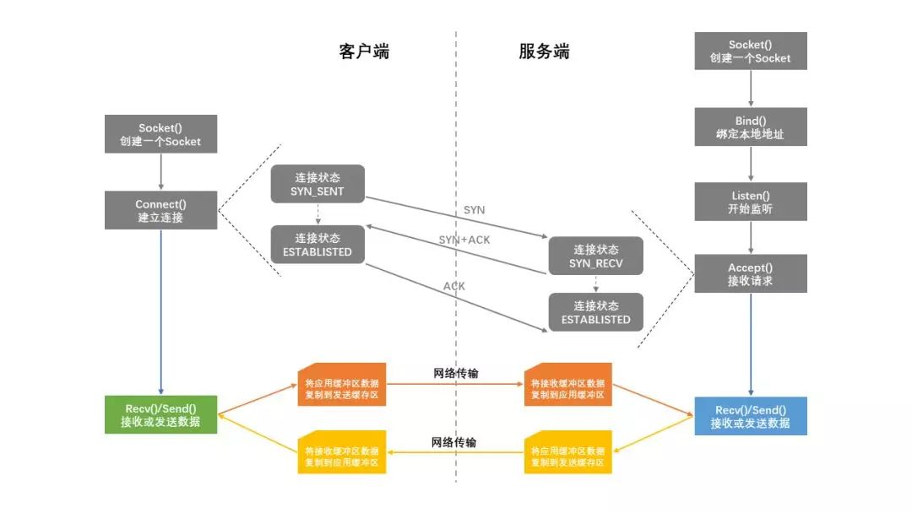


如图所示，在建立连接以后，服务端和客户端分别通过上一过程中建立连接的 socket 描述符进行传输工作。分别调用操作系统提供的 recv 和 send 接口实现数据传输。

数据传输完毕后，就是断开连接的过程了。相比于建立连接的过程，连接关闭的过程要更复杂一些。过程如下：

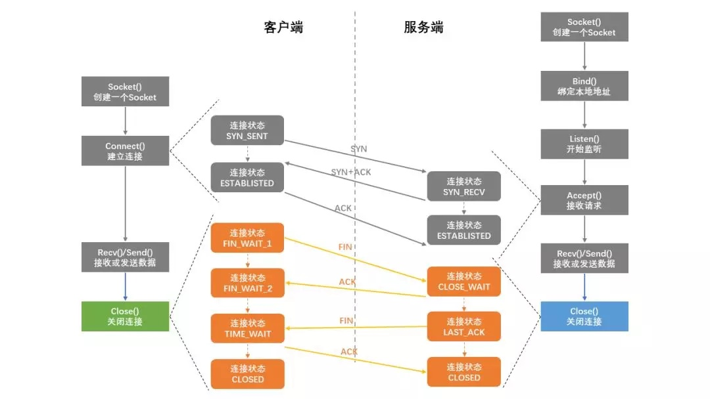

相比于建立连接的三次握手过程，关闭连接多了一个数据传输，被称为 ”四次挥手“ 过程。

上面三个过程为完整的通过 socket 编程建立连接并进行通信最后关闭连接的过程。本文中的 ftp 客户端和 ftp 服务端也是通过上述的三个过程来实现通信和文件传输的，并确保了可靠性。具体实现细节在第三部分讲解。

## 2 环境配置及编译

### 2.1 该源码在正常安装的前提下所需的环境描述

所需环境为 Linux 系统。编译器为 gcc，采用 Makefile 的方式进行项目管理。调试器为 gdb。

### 2.2 编译过程， makefile解读

编译分为两个部分，分别是客户端程序的编译和服务端程序的编译。

首先是编译服务端的 Makfile 脚本解读：


上图为编译 ftp 服务端的 Makefile 脚本，我在里面添加了注释。一个 Makefile 脚本里面通常包含了五个部分：变量定义，显示规则，隐晦规则，文件指示和注释。

在 Makefile 中，变量都为字符串，执行 Makefile 文件时，变量都会被扩展到相应的引用上。Makefile 执行的是一系列的规则，规则定义了要生成的文件，生成文件所需要的依赖，已经生成文件的命令。Makefile 也支持自动推导，也就是我们可以写隐晦规则，比如它可以自动的把 .c 文件放在 .o 文件的依赖中，而不需要书写。

有了基础知识以后，就可以解读图中的 Makefile 脚本了，脚本的最终目的是生成 ftserve 这种可执行文件，它需要 OBJ 作为依赖，而 OBJ 的生成需要一系列源文件作为依赖，并通过编译器再加上编译命令来生成。生成 ftpserve 后，执行 make clean 命令就可以删除中间文件。

下图为编译生成 ftp 客户端的 Makefile 脚本

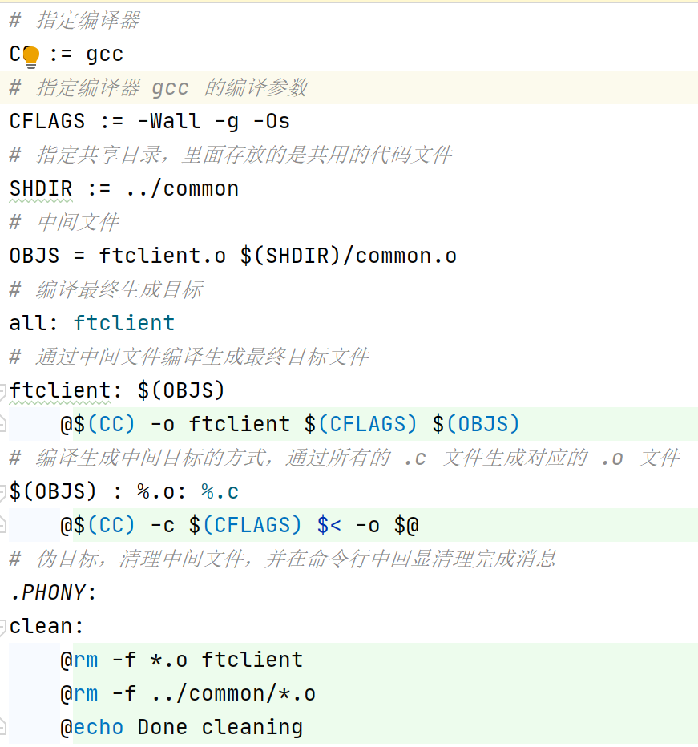

## 3 源码阅读

### 3.1 源码解释

我们首先对 ftp 服务端的源码做解读，解读源码的顺序为，main 函数实现的整体逻辑，main 中所调用的功能函数，各个功能函数下的子函数。

```c
int main(int argc, char *argv[])
{
    int sock_listen, sock_control, port, pid;

    if (argc != 2)
    {
        printf("usage: ./ftpserver port\n");
        exit(0);
    }

    port = atoi(argv[1]);

    // create socket 创建套接字，并完成 地址结构设置， bind， listen 等一系列操作
    if ((sock_listen = socket_create(port)) < 0)
    {
        perror("Error creating socket");
        exit(1);
    }

    while (1)
    {    // wait for client request

        // create new socket for control connection 阻塞，监听，获取客户端地址结构，返回新建立的套接字文件描述符
        if ((sock_control = socket_accept(sock_listen)) < 0)
            break;

        // create child process to do actual file transfer，创建子进程用于文件传输
        if ((pid = fork()) < 0)
        {
            perror("Error forking child process");
        } else if (pid == 0)
        {
            close(sock_listen); // 关闭监听套接字， 只使用建立客户端连接的套接字
            ftserve_process(sock_control); // 建立连接后的操作，
            close(sock_control); // 关闭连接套接字
            exit(0);   // 退出程序，完成操作
        }

        close(sock_control);
    }

    close(sock_listen);

    return 0;
}
```

上图为 main 函数，首先处理命令行参数，读取 ftp 端口号。然后通过 socket_create 函数创建对应端口号的套接字。创建好 socket 后，进入循环，socket_accept 函数阻塞等待客户端的连接，一旦有客户端进行连接，返回一个新的连接套接字 sock_control 用于后续的通信过程，创建连接以后先通过 fork 函数创建一个新的进程，创建好新的进程以后，监听套接字就不需要了，调用 close 函数关闭。然后通过 ftserve_process 函数执行 ftp 服务端的一系列操作。完成操作后调用 close 函数将连接套接字 sock_controll 也关闭。最后退出 main 函数。整个 ftp 服务端程序终止。

上述为 main 函数的主要逻辑，其中的功能函数实现如下：

首先是 socket_create 函数

```c
int socket_create(int port)
{
    int sockfd;
    int yes = 1;
    struct sockaddr_in sock_addr;

    // create new socket
// ipv4, 流式类型
    if ((sockfd = socket(AF_INET, SOCK_STREAM, 0)) < 0)
    {
        perror("socket() error");
        return -1;
    }

    // set local address info
    sock_addr.sin_family = AF_INET;
    sock_addr.sin_port = htons(port);  // 本地字节序转网络字节序，16位 所以为 htons ,s 表示 short
    sock_addr.sin_addr.s_addr = htonl(INADDR_ANY);        //本地任意 ip


    if (setsockopt(sockfd, SOL_SOCKET, SO_REUSEADDR, &yes, sizeof(int)) == -1)
    {
        close(sockfd);
        perror("setsockopt() error");
        return -1;
    }

    // bind， 给套接字绑定 ip 加 端口号
    if (bind(sockfd, (struct sockaddr *) &sock_addr, sizeof(sock_addr)) < 0)
    {
        close(sockfd);
        perror("bind() error");
        return -1;
    }

    // begin listening for incoming TCP requests， 设置同时与服务器建立连接的上限数。
    if (listen(sockfd, 5) < 0)
    {
        close(sockfd);
        perror("listen() error");
        return -1;
    }
    return sockfd;
}
```

如图所示，首先通过 socket 函数创立一个套接字，指定为 ipv4 地址，并设定为流式类型数据，即 tcp 传输协议。再指定 bind 函数所需的本地地址结构信息。通过 bind 函数讲本地地址结构信息绑定在前面所创立的 socket 上。最后通过 listen 函数监听此套接字。

下面是 sock_accept 函数

```c
int socket_accept(int sock_listen)
{
    int sockfd;
// 客户端地址结构
    struct sockaddr_in client_addr;
    socklen_t len = sizeof(client_addr);

    // Wait for incoming request, store client info in client_addr， 阻塞等待客户端连接。
    sockfd = accept(sock_listen, (struct sockaddr *) &client_addr, &len);

    if (sockfd < 0)
    {
        perror("accept() error");
        return -1;
    }
    return sockfd;
}
```

sock_accept 函数通过 accept 函数阻塞等待客户端连接，连接成功后返回与客户端简历连接的套接字描述符。

ftserve_process 函数为服务端和客户端建立连接以后服务端和客户端交互并实现 ftp 逻辑的函数。其实现细节如下：

```c
void ftserve_process(int sock_control)
{
    int sock_data;
    char cmd[5];
    char arg[MAXSIZE];

    // Send welcome message
    send_response(sock_control, 220);

    // Authenticate user
    if (ftserve_login(sock_control) == 1)
    {
        send_response(sock_control, 230);
    } else
    {
        send_response(sock_control, 430);
        exit(0);
    }

    while (1)
    {
        // Wait for command
        int rc = ftserve_recv_cmd(sock_control, cmd, arg);

        if ((rc < 0) || (rc == 221))
        {
            break;
        }

        if (rc == 200)
        {
            // Open data connection with client
            if ((sock_data = ftserve_start_data_conn(sock_control)) < 0)
            {
                close(sock_control);
                exit(1);
            }

            // Execute command
            if (strcmp(cmd, "LIST") == 0)
            { // Do list
                ftserve_list(sock_data, sock_control);
            } else if (strcmp(cmd, "RETR") == 0)
            { // Do get <filename>
                ftserve_retr(sock_control, sock_data, arg);
            }

            // Close data connection
            close(sock_data);
        }
    }
}
```

如上图所示，函数通过建立连接的 socket 描述符进行一系列的操作，首先是调用 send_response 函数发送欢迎信息给客户端，状态码为 220。然后进行用户验证，调用 ftserve_login 函数，验证通过就发送登录成功状态码 230，否则就发送 530 状态码，表示无法登录，并退出。成功登录后，进入循环，首先调用 ftserve_recv_cmd 函数接收命令并返回状态码，对状态码进行校验，如果状态码为 200 表示命令确定，并执行后续操作。后续操作为先建立一个用于数据传输的 socket 并返回该 socket 的描述符。根据 ftserve_recv_cmd 中得到的 cmd 命令分别执行 LIST 操作和 RETR 操作。LIST 操作分别使用了 sock_control 和 sockdata 两个 socket，调用 ftserve_list 函数，函数调用系统命令 ls -l | tail -n+2 将输出内容定向到一个临时文件，并将临时文件的内容通过 socket_data 发送到客户端。期间通过 socket_contol 发送状态码。RETR 操作通过 ftserve_recv_cmd 函数得到的命令参数用 fopen 读取文件，并将读取的文件用 send 命令发送到客户端。

以上过程用到的函数见源码，此处不再赘述。

下面讲解 ftp 客户端的源码，解读顺序同服务端的一样

首先是 main 函数代码

```c
int main(int argc, char* argv[]) 
{     
   int data_sock, retcode, s;
   char buffer[MAXSIZE];
   struct command cmd;    
   struct addrinfo hints, *res, *rp;

   if (argc != 3) {
      printf("usage: ./ftclient hostname port\n");
      exit(0);
   }

   char *host = argv[1];
   char *port = argv[2];

   // Get matching addresses
   memset(&hints, 0, sizeof(struct addrinfo));
   hints.ai_family = AF_UNSPEC;
   hints.ai_socktype = SOCK_STREAM;
   
   s = getaddrinfo(host, port, &hints, &res);
   if (s != 0) {
      printf("getaddrinfo() error %s", gai_strerror(s));
      exit(1);
   }
   
   // Find an address to connect to & connect
   for (rp = res; rp != NULL; rp = rp->ai_next) {
      sock_control = socket(rp->ai_family, rp->ai_socktype, rp->ai_protocol);

      if (sock_control < 0)
         continue;

      if(connect(sock_control, res->ai_addr, res->ai_addrlen)==0) {
         break;
      } else {
         perror("connecting stream socket");
         exit(1);
      }
      close(sock_control);
   }
   freeaddrinfo(rp);


   // Get connection, welcome messages
   printf("Connected to %s.\n", host);
   print_reply(read_reply()); 
   

   /* Get name and password and send to server */
   ftclient_login();

   while (1) { // loop until user types quit

      // Get a command from user
      if ( ftclient_read_command(buffer, sizeof buffer, &cmd) < 0) {
         printf("Invalid command\n");
         continue;  // loop back for another command
      }

      // Send command to server
      if (send(sock_control, buffer, (int)strlen(buffer), 0) < 0 ) {
         close(sock_control);
         exit(1);
      }

      retcode = read_reply();       
      if (retcode == 221) {
         /* If command was quit, just exit */
         print_reply(221);     
         break;
      }
      
      if (retcode == 502) {
         // If invalid command, show error message
         printf("%d Invalid command.\n", retcode);
      } else {         
         // Command is valid (RC = 200), process command
      
         // open data connection
         if ((data_sock = ftclient_open_conn(sock_control)) < 0) {
            perror("Error opening socket for data connection");
            exit(1);
         }        
         
         // execute command
         if (strcmp(cmd.code, "LIST") == 0) {
            ftclient_list(data_sock, sock_control);
         } 
         else if (strcmp(cmd.code, "RETR") == 0) {
            // wait for reply (is file valid)
            if (read_reply() == 550) {
               print_reply(550);     
               close(data_sock);
               continue; 
            }
            ftclient_get(data_sock, sock_control, cmd.arg);
            print_reply(read_reply()); 
         }
         close(data_sock);
      }

   } // loop back to get more user input

   // Close the socket (control connection)
   close(sock_control);
   return 0;
}
```

首先处理命令行参数，得到 host 和 post 分别代表服务端的地址和端口号。然后绑定本地地址信息，并通过端口号和 ip 地址获取地址信息。然后从地址信息中找到可用的地址与服务器建立 socket 连接。并返回建立连接的 socket 描述符 sock_control。建立连接后，先获取欢迎信息。然后调用 ftclient_login 函数从命令行中读取用户名和密码用于在服务端进行用户验证。如果验证成功，进入循环。循环中先调用 ftclient_read_command 函数从命令行中读取需要的操作命令和参数。并存入 buffer 中，将 buffer 调用 send 函数发送到服务端，进行校验。调用 read_reply 获取服务端的答复。如果校验成功，则先建立一个数据传输 socket 并返回一个描述符 data_sock。最后同时用 data_sock 和 sock_control 两个描述符和参数完成 LIST 和 RETR 操作。

上述过程调用的函数中的重要函数如下：

首先是 ftclient_login 函数，实现如下

```c
void ftclient_login()
{
   struct command cmd;
   char user[256];
   memset(user, 0, 256);

   // Get username from user
   printf("Name: ");  
   fflush(stdout);       
   read_input(user, 256);

   // Send USER command to server
   strcpy(cmd.code, "USER");
   strcpy(cmd.arg, user);
   ftclient_send_cmd(&cmd);
   
   // Wait for go-ahead to send password
   int wait;
   recv(sock_control, &wait, sizeof wait, 0);

   // Get password from user
   fflush(stdout);    
   char *pass = getpass("Password: ");    

   // Send PASS command to server
   strcpy(cmd.code, "PASS");
   strcpy(cmd.arg, pass);
   ftclient_send_cmd(&cmd);
   
   // wait for response
   int retcode = read_reply();
   switch (retcode) {
      case 430:
         printf("Invalid username/password.\n");
         exit(0);
      case 230:
         printf("Successful login.\n");
         break;
      default:
         perror("error reading message from server");
         exit(1);      
         break;
   }
}
```

如图所示，函数通过从用户命令行中读取用户名和密码，然后调用 ftclient_send_cmd 函数发送给服务端，并调用 recv 函数从服务端接收消息。如果得到的代码是 430，那么表示用户名和密码无效。如果是230，表示登录成功。

下面是通过 sock_control 这个套接字与服务端建立数据传输套接字的  ftclient_open_conn 函数

```c
int ftclient_open_conn(int sock_con)
{
   int sock_listen = socket_create(CLIENT_PORT_ID);

   // send an ACK on control conn
   int ack = 1;
   if ((send(sock_con, (char*) &ack, sizeof(ack), 0)) < 0) {
      printf("client: ack write error :%d\n", errno);
      exit(1);
   }     

   int sock_conn = socket_accept(sock_listen);
   close(sock_listen);
   return sock_conn;
}
```

如图所示，通过 sock_create 函数创建一个新的套接字，然后通过该套接字与服务器连接，并返回套接字作为新的数据连接套接字。

下面是客户端执行 LIST 操作的函数 ftclient_list

```c
int ftclient_list(int sock_data, int sock_con)
{
   size_t num_recvd;        // number of bytes received with recv()
   char buf[MAXSIZE];       // hold a filename received from server
   int tmp = 0;

   // Wait for server starting message
   if (recv(sock_con, &tmp, sizeof tmp, 0) < 0) {
      perror("client: error reading message from server\n");
      return -1;
   }
   
   memset(buf, 0, sizeof(buf));
   while ((num_recvd = recv(sock_data, buf, MAXSIZE, 0)) > 0) {
           printf("%s", buf);
      memset(buf, 0, sizeof(buf));
   }
   
   if (num_recvd < 0) {
           perror("error");
   }

   // Wait for server done message
   if (recv(sock_con, &tmp, sizeof tmp, 0) < 0) {
      perror("client: error reading message from server\n");
      return -1;
   }
   return 0;
}
```

如上图所示，客户端这边直接通过 recv 接收服务端传来的数据，并写入 buffer 中，打印 buffer。

下面是客户端执行 get 操作的函数

```c
int ftclient_get(int data_sock, int sock_control, char* arg)
{
    char data[MAXSIZE];
    int size;
    FILE* fd = fopen(arg, "w");
    
    while ((size = recv(data_sock, data, MAXSIZE, 0)) > 0) {
        fwrite(data, 1, size, fd);
    }

    if (size < 0) {
        perror("error\n");
    }

    fclose(fd);
    return 0;
}
```

如图所示，函数先创建一个文件指针 fd，然后循环调用 recv 函数从服务端那边读取传来的数据，并写入创建好的文件指针中。

### 3.2 函数调用关系图

服务端函数调用关系图如下

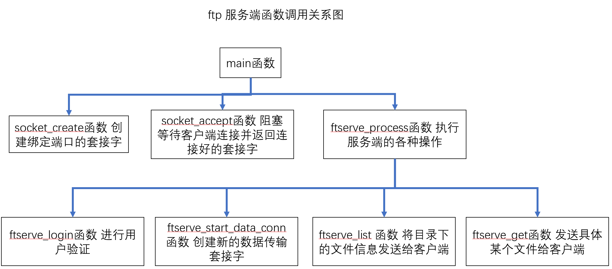

客户端如下：

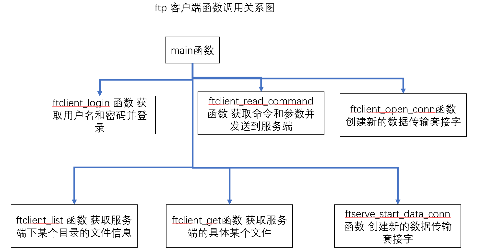

### 3.3 函数功能性列表

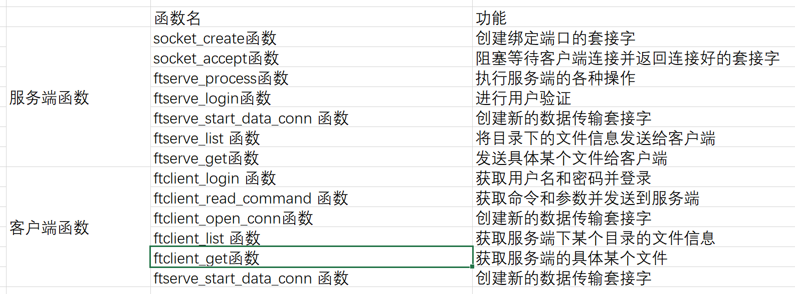

## 4 实验及验证

### 4.1 给出实例程序的文字描述和解释

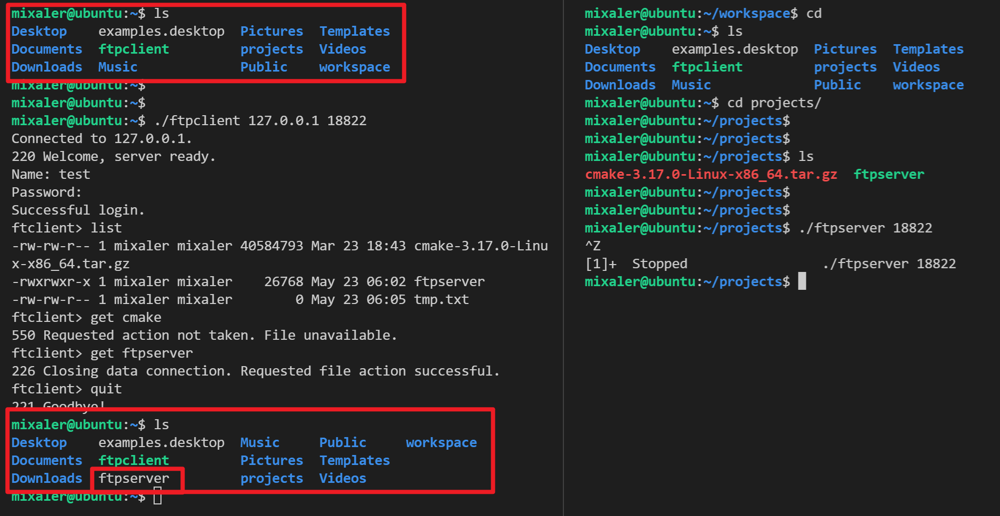

如上图为 ftp 客户端和 ftp 服务端的运行过程。在 ftp 客户端运行 list 命令，客户端显示了服务端所在文件夹内的文件列表。然后客户端使用 get ftpserver 命令，将服务端所在文件夹内的服务端本身的可执行代码拷贝到了客户端所在的文件夹内。

### 4.2 gdb 调试过程

下面给出服务端和客户端运行过程中的部分调试过程。通过 clion 调用 gdb 来跟踪其中的关键变量来实现调试


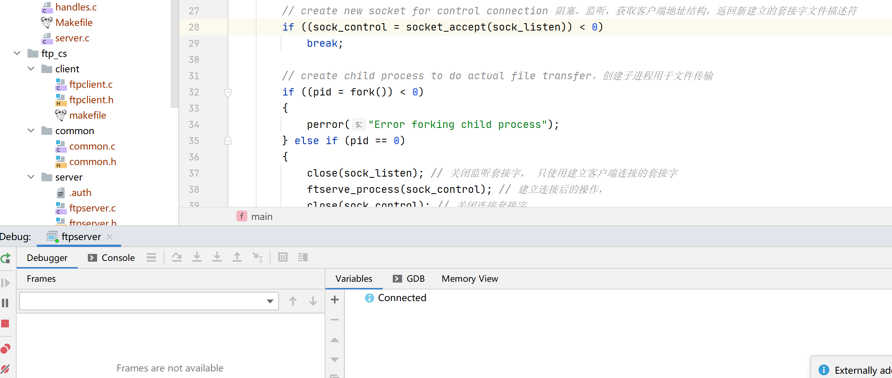

上面分别为刚开始调试时创建 sock_listen 的过程，在执行 sock_accept时阻塞等待客户端来连接，这是我们启动客户端，也进行调试

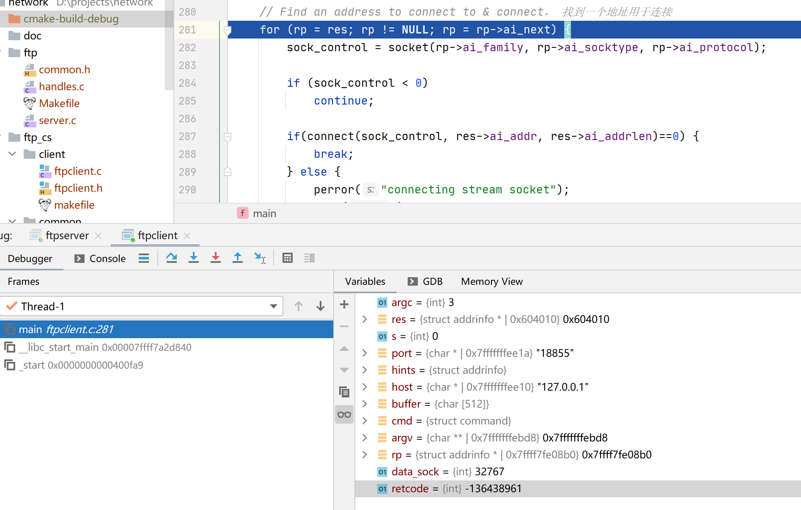

如上是客户端刚启动时的部分变量值，然后执行下一步，与服务端进行连接

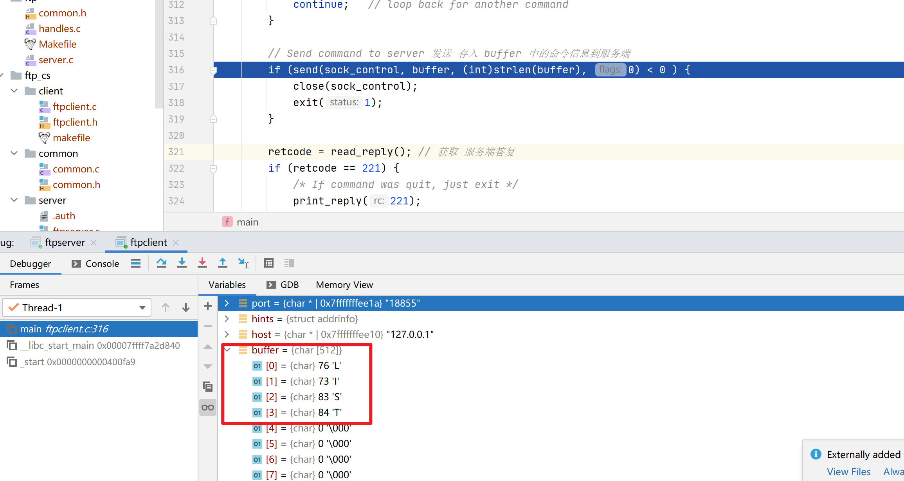

与服务端建立连接后，通过 ftclient_read_command 函数读取命令行中的输入，可以看见 buffer 中的值为 LIST，调用 send 将其发送到服务端。

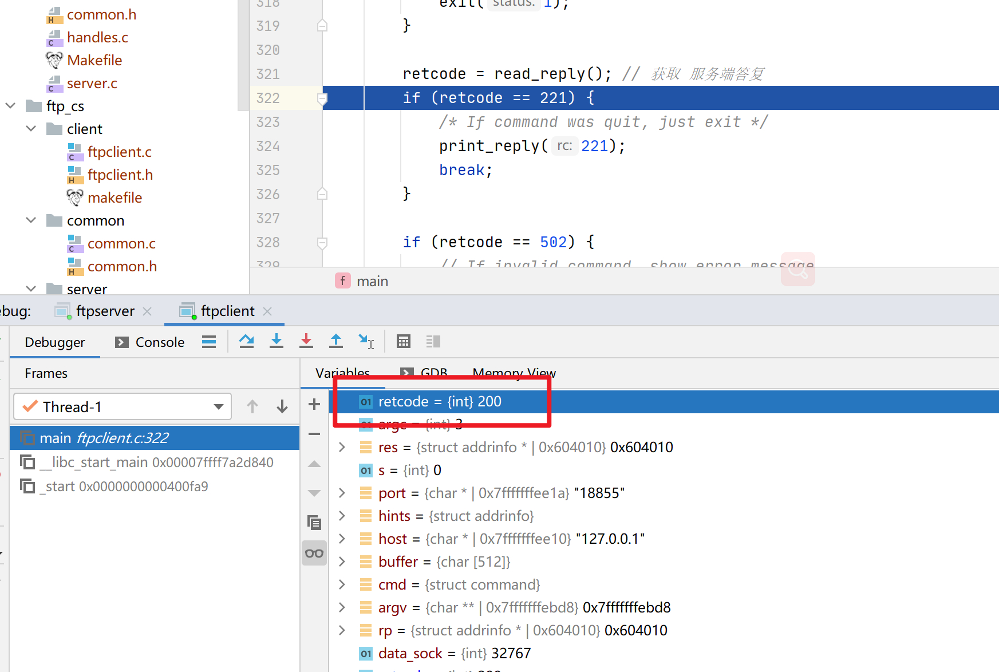

发送给服务器后，得到的答复代码为 200 ，表示可以进行后续的操作。

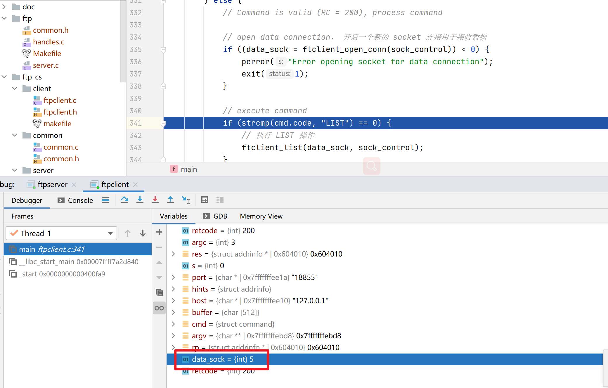

如图所示，建立的数据传输 socket 描述符值为 5。


如图所示为执行 LIST 操作时客户端从服务端读到的 buffer 中的一部分内容，其中的 r, w, 等字符表示文件权限。

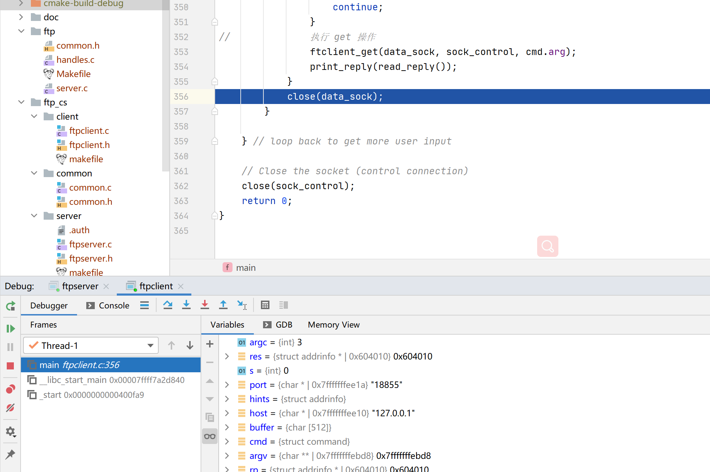


执行完 LIST 操作后，就可以关闭数据传输套接字和控制套接字，如果在命令行中输入 quit 命令的话。客户端就运行结束了。

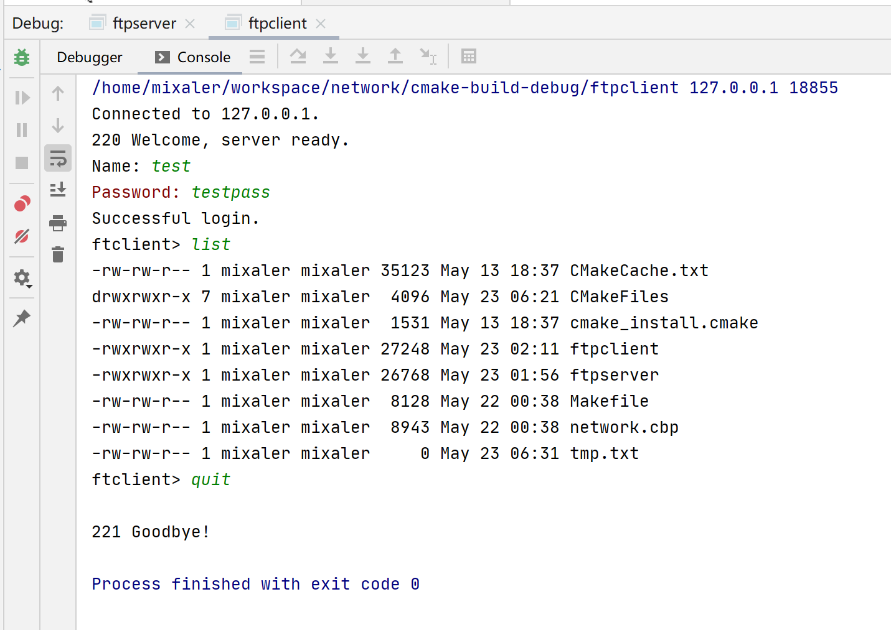

上图为命令行界面。


