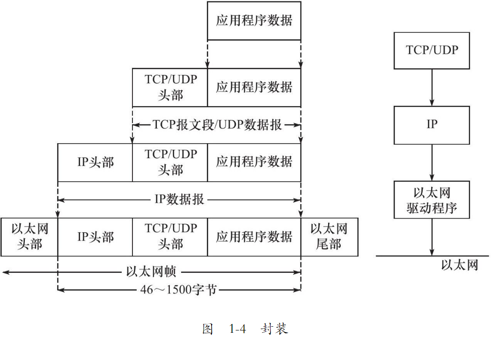
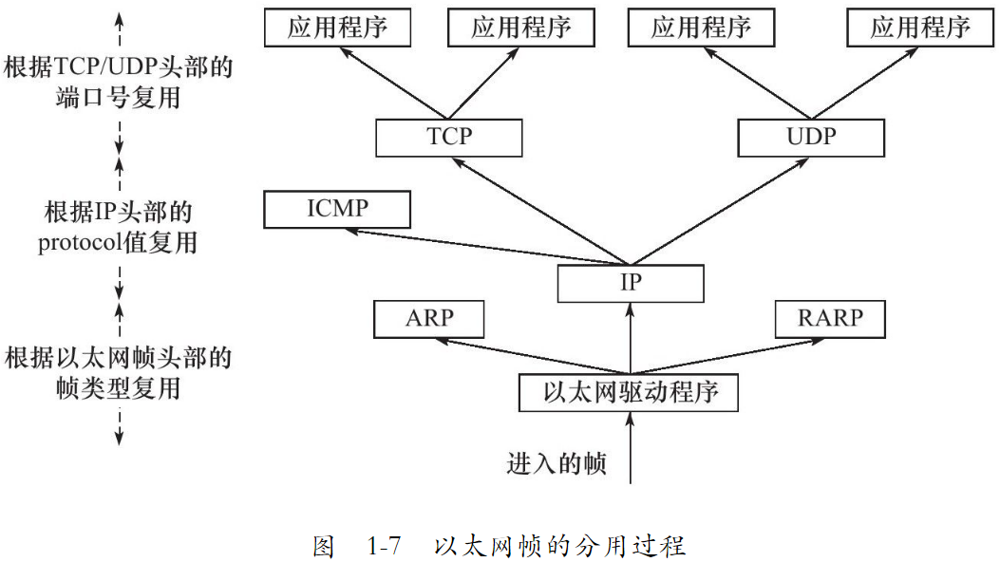
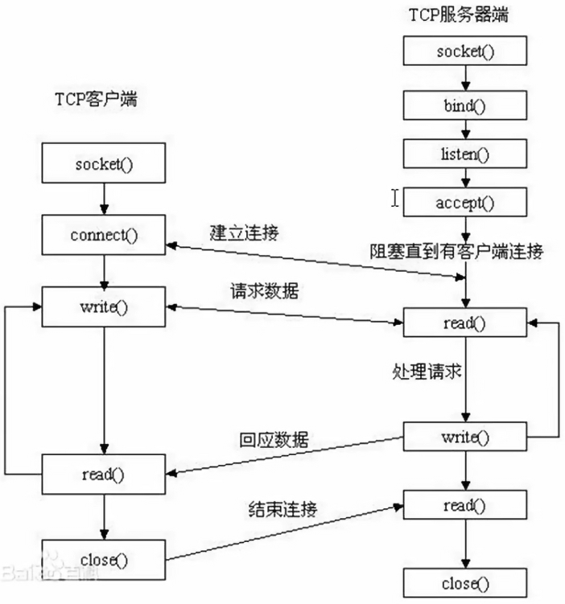
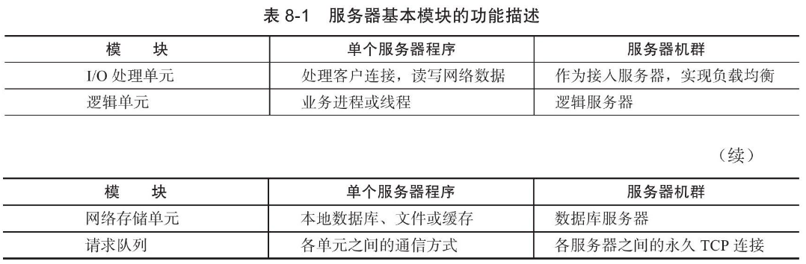

# TCP/IP 协议详解

## 1 TCP/IP 协议族

### 1.1 TCP/IP 协议族体系结构以及主要协议

TCP/IP 协议族是一个四层协议系统，自底向上分别是数据链路层，网络层，传输层和应用层。每一层完成不同的功能，且通过若干协议来实现，上层协议使用下层协议提供的服务。如下图所示：


#### 1.1.1 数据链路层

数据链路层实现了网卡接口的网络驱动程序，以处理数据在物理媒介上的传输。不同的物理网络具有不同的电气特性，网络驱动程序隐藏了这些细节，为上层协议提供了一个统一的接口。

数据链路层两个常用的协议是 ARP 协议（Address Resolve Protocol，地址解析协议）和 RARP（Reverse Address Resolve Protocol，逆地址解析协议）。它们实现了 Ip 地址和机器物理地址之间的相互转换。

网络层使用 IP 地址寻址一台机器，而数据链路层使用物理地址寻址一台机器，因此网络层必须先将目标机器的 IP 地址转换为物理地址，才能使用数据链路层提供的服务，这就是 ARP 协议的用途。

#### 1.1.2 网络层

网络层实现数据包的选路和转发。WAN（Wide Area Network，广域网）通常使用总舵分级的路由器来连接分散的主机或 LAN（Local Area Network，局域网），因此，通信的两台主机一般不是直接相连的，而是通过多个中间节点（路由器）连接的。网络层的任务就是选择这些中间节点，以确定两台主机之间的通信路径。同时，网络层对上层协议隐藏了网络拓扑连接的细节，使得传输层和网络应用程序看来，通信双方是直接相连的。

网络层最核心的协议是 IP（Internet Protocol，因特网协议）。IP 协议根据数据包的目的 IP 地址来决定如何投递它。如果数据包不能直接发送给目的主机，那么 IP 协议就为它寻找一个合适的下一跳（next hop）路由器，并将数据包交付给该路由器来转发。多次重复这一过程，数据包最终到达目标主机，或者由于发送失败而被丢弃。

网络层另外一个重要的协议是 ICMP 协议（Internet Control Message Protocol，因特网控制报文协议）。它是 IP 协议的重要补充，主要用于检测网络连接。ICMP 协议使用的报文格式如下图所示：


#### 1.1.3 传输层

传输层为两台主机上的应用程序提供端到端（end to end）的通信。与网络层使用的逐跳通信方式不同，传输层只关心通信的起始段和目的端，而不在乎数据包的中转过程。下图展示了传输层和网络层的这种区别


传输层的协议主要有三个：TCP 协议，UDP 协议和 SCTP 协议

TCP 协议（Transmission Control Protocol，传输控制协议）为应用层提供可靠的，面向连接的和基于流（stream）的服务。TCP 协议使用超时重传，数据确认等方式来确保数据包被正确地发送至目的端，因此 TCP 服务是可靠的。使用 TCP 协议通信的双方必须先建立 TCP 连接，并在内核中为该连接维持一些必要的数据结构，比如连接的状态，读写缓冲区，以及诸多定时器等。当通信结束时，双方必须关闭连接以释放这些内核数据。TCP 服务时基于流的。基于流的数据没有边界（长度）限制，它源源不断地从通信的一端流入另一端。发送端可以逐个字节地向数据流中写入数据，接收端也可以逐个字节的将它们读出。

UDP 协议（User Datagram Protocol，用户数据包协议）则与 TCP 协议完全相反，它为应用层提供不可靠，无连接和基于数据包的服务。“不可靠”意味着 UDP 协议无法保证从发送端正确地传送到目的端。如果数据在中途丢失，或者目的端通过数据校验发现数据错误而将其丢弃，则 UDP 协议只是简单地通知应用程序发送失败。因此，使用 UDP 协议的应用程序通常要自己处理数据确认，超时重传等逻辑。UDP 协议是无连接的，即通信双方不保持一个长久的联系，因此应用程序每次发送数据都要明确指定接收端的地址（IP 地址等信息）。基于数据报的服务是相对于基于流的服务而言的。每个 UDP 都有一个长度，接收端必须以该长度为最小单位将其内容一次性读出，否则数据将被截断。

#### 1.1.4 应用层

应用层负责处理应用程序的逻辑。数据链路层，网络层和传输层负责处理网络通信细节，这部分必须即稳定又高效，因此它们都在内核空间中实现。如下图所示：


而应用层则在用户空间中实现，因为它负责处理众多逻辑，比如文件传输，名称查询和网络管理等。如果应用层也在内核中实现，则会使内核变得非常庞大。当然，也有少数服务器程序是在内核中实现的，这样代码就无须在内核空间和用户空间来回切换（主要是数据的复制），极大地提高了工作效率。不过这种代码实现起来较为复杂，不够灵活，且不便于移植。这里只讨论用户空间的网络编程。

### 1.2 封装

上层协议如何使用下层协议提供的服务呢？通过封装实现。应用程序数据在发送到物理网络上之前，将沿着协议栈从上网下依次传递。每层协议都将在上层数据的基础上加上自己的头部信息（有时还包括尾部信息），以实现该层的功能，这个过程就叫做封装。



### 1.3 分用

当帧达到目的主机时，将沿着协议栈自底向上依次传递。各层协议依次处理帧中本层负责的头部数据，以获取所需的信息，并最终将处理后的帧交给目标应用程序。这个过程称为分用。分用是靠头部信息中的类型字段实现的。



### 1.4 测试网络

### 1.5 ARP 协议工作原理

### 1.6 DNS 协议工作原理

### 1.7 socket 和 TCP/IP 协议族的关系

数据链路层，网络层，传输层协议是在内核中实现的。因此操作系统需要实现一组系统调用，使得应用程序能够访问这些协议提供的服务。实现这组系统调用的 API 就是就是 socket。

由 socket 定义的这一组 API 提供两点功能：一是将应用程序数据从用户缓冲区中复制到 TCP/UDP 内核发送缓冲区，以交付内核来发送数据，或者是从内核 TCP/UDP 接收缓冲区中复制数据到用户缓冲区，以读取数据。二是应用程序可以通过它们来修改内核中各层协议的某些头部信息或其他数据结构，从而精细地控制底层通信的行为。比如可以通过 setsockopt 函数来设置 IP 数据报在网络上的存活时间。

## 2 IP 协议详解

## 3 TCP 协议详解

## 4 TCP/IP 通信案例：访问 Internet 上的 Web 服务器

Web客户端和服务器之间使用HTTP协议通信。HTTP协议的内容相当广泛，涵盖了网络应用层协议需要考虑的诸多方面。因此，学习HTTP协议对应用层协议设计将大有裨益。

### 2.1 套接字概念

在通信过程中，套接字一定是成对出现的。一端的发送缓冲区对应另一端的接收缓冲区。使用同一个文件描述符指向一个套接字（该套接字内部由内核建立的发送缓冲区和接收缓冲区实现）


### 2.2 预备知识

#### 2.2.1 网络字节序

大小端的区别

小端法：主机存储，高位高地址，地位存低地址， int a = 0x12345678

大端法：网络存储，高位存低地址，地位存高地址。

因此需要网络字节序和主机字节序的转换

htonl --> 本地转网络 争对网络（IP）

htos --> 本地转网络 针对 端口

ntohl --> 网络转本地 争对网络（IP）

ntohs --> 网络转本地 针对端口


#### 2.2.2 IP地址转换函数

上面的转换太麻烦，于是有

#include <arpa/inet.h>

本地转网络

```c
   int inet_pton(int af, const char *src, void *dst);
```
网络转本地

```c
const char *inet_ntop(int af, const void *src, char *dst, socklen_t size);
```

#### 2.2.3 sockaddr 数据

sockaddr 地址结构，缺陷是 sa_data 把目标地址和端口信息混在一起了

struct sockaddr {       

​			sa_family_t sin_family;     *//地址族* 　  

​			char sa_data[14];            *//14字节，包含套接字中的目标地址和端口信息*                　 

​					}; 

struct sockaddr_in addr;

```c
struct sockaddr_in
  {
   	sa_family_t sin_family		// 地址簇 
    in_port_t sin_port;          /* Port number. 16 位端口号 */
    struct in_addr sin_addr;      /* Internet address. 32 位 ip 地址 */

    /* Pad to size of `struct sockaddr'.  */
    unsigned char sin_zero[sizeof (struct sockaddr) -
            __SOCKADDR_COMMON_SIZE -
            sizeof (in_port_t) -
            sizeof (struct in_addr)];
  };
```

addr.sin_family = AF_INET/AF_INET6

addr.sin_port = htons(8888)

int dst

addr.sin_addr.s_addr =  inet_pton(AF_INET, "192.168.1.188", (void *)&dst)

bind(fd, (struct sockaddr *)&addr, size);

sockaddr 常用于 bind, connect, recvfrom, sendto 等函数的参数，指明地址信息，是一种通用的套接字地址。

sockaddr_in 是 internet 环境下的套接字的地址形式。所以在网络编程中我们会对 sockaddr_in 结构体进行操作，使用 sockaddr_in 来建立所需要的信息，最后使用类型转换就可以了。一般先把 sockaddr_in 变量赋值后，强制类型转换后传入 sockaddr 做参数的函数。sockaddr_in 用于 socket 的定义和赋值，sockaddr 用于函数参数。

```c
// set local address info
sock_addr.sin_family = AF_INET;
sock_addr.sin_port = htons(port);  // 本地字节序转网络字节序，16位 所以为 htons ,s 表示 short
sock_addr.sin_addr.s_addr = htonl(INADDR_ANY);    //
```

INADDR_ANY 转换过来就是0.0.0.0，泛指本机的意思，也就是表示本机的所有IP，因为有些机子不止一块网卡，多网卡的情况下，这个就表示所有网卡ip地址的意思。比如一台电脑有3块网卡，分别连接三个网络，那么这台电脑就有3个ip地址了，如果某个应用程序需要监听某个端口，那他要监听哪个网卡地址的端口呢？

如果绑定某个具体的ip地址，你只能监听你所设置的ip地址所在的网卡的端口，其它两块网卡无法监听端口，如果我需要三个网卡都监听，那就需要绑定3个ip，也就等于需要管理3个套接字进行数据交换，这样岂不是很繁琐？

所以出现INADDR_ANY，你只需绑定INADDR_ANY，管理一个套接字就行，不管数据是从哪个网卡过来的，只要是绑定的端口号过来的数据，都可以接收到。

### 2.3 网络套接字函数



socket建立过程需要三个套接字，服务端有两个，还有一个用于监听。


#### 2.3.1 socket

#include <sys/socket.h>

int socket(int domain, int type, int protocol);

详见 man 2 socket

##### 参数

-   domain 选择用来通信的协议簇
    -   AF_INET：ipv4
    -   AF_INET6：ipv6
    -    AF_UNIX: 本地通信
-   type 指定通信语义，常用的如下：
    -   SOCK_STREAM：提供顺序的、可靠的、双向的、基于连接的字节流。可能支持带外数据传输机制。就是 tcp
    -   SOCK_DGRAM：支持数据报(固定最大长度的无连接、不可靠的消息)。就是 udp
-   protocol: 指定与套接字一起使用的特定协议。通常，在给定的协议族中，只有一个协议支持特定的套接字类型，在这种情况下，值设定为 0。

##### 返回值

新套接字对应的文件描述符，失败是 -1 并设置 errno。

#### 2.3.2 setsockopt/getsockopt

设置或获取 sockets 选项

#include <sys/types.h>          /* See NOTES */
       #include <sys/socket.h>

```c
   int getsockopt(int sockfd, int level, int optname,
                  void *optval, socklen_t *optlen);
   int setsockopt(int sockfd, int level, int optname,
                  const void *optval, socklen_t optlen);
```

setsockopt() 函数，用于任意类型、任意状态套接字的设置选项值。尽管在不同协议层上存在选项，但本函数仅定义了最高的“套接口”层次上的选项。

#### 2.3.3 bind

给 socket 绑定一个 ip 加端口号（也就是一个地址结构）

int bind( int sockfd, const struct sockaddr *addr, socklent_t addrlen);

-   sockfd: socket 函数返回值
-   struct sockaddr_In addr;传入参数
-   addr.sin_family = AF_INET
-   addr.sinport = htons(8888);
-   addr.sin_addr.s_addr = htol(INADDR_ANY);
-   addr : (struct sockaddr *)&addr
-   addrlen: sizeof(addr) 地址结构大小

成功为 0，失败是 -1 并返回 errno

#### 2.3.4 listen

int listen(int sockfd, int backlog);

设置同时与服务器建立连接的上限数。（同时进行三次握手的客户端数量）

sockfd: socket 函数返回值

backlog： 上限数值。最大值为 128

成功为 0，失败是 -1 并返回 errno

不阻塞监听

#### 2.3.5 accept

int accept(int sockfd, struct sockaddr *addr, socklen_t *addrlen); 阻塞等待客户端建立连接，成功的话，返回一个与客户端成功连接的socket 文件描述符

sockfd: socket 函数返回值

addr: 传出参数，成功与服务器建立连接的那个客户端的地址结构（ip + port）

addrlen: 传入传出。入：addr 的大小。出： 客户端 addr 的实际大小

返回值： 

-   能与服务器进行通信的 socket 的文件描述符（如果成功），失败 -1 并返回设置 errno

#### 2.3.6 connect

int connect( int sockfd, const struct sockaddr *addr, socklen_t addrlen); 使用现有的 sockfd 与服务器建立连接

sockfd : 客户端调用 socket 函数的返回值

addr 传入参数：服务器的地址结构

addrlen: 服务器地址结构的长度

成功为 0，失败是 -1 并返回 errno

如果不使用 bind 绑定客户端地址结构，采用“隐式绑定”。

TCP 通信流程分析

server

1.  socket() 				创建 socket
2.  bind()                     绑定服务器地址结构
3.  listen()                   设定监听上限
4.  accept()                 阻塞监听客户端连接
5.  read(fd)                 读 socket 获取客户端数据
6.  操作，对数据进行操作
7.  write(fd)
8.  close(fd)

client

1.  socket()                 创建 socket
2.  connect()               与服务器建立连接
3.  write()                    写数据到 socket
4.  read()                     读取服务器的数据
5.  操作，操作服务器的数据
6.  close(fd);

#### 2.3.7 send, sendto, sendmsg

通过 socket 发送信息到另一个 socket

#include <sys/types.h>
       #include <sys/socket.h>

```c
   ssize_t send(int sockfd, const void *buf, size_t len, int flags);

   ssize_t sendto(int sockfd, const void *buf, size_t len, int flags,
                  const struct sockaddr *dest_addr, socklen_t addrlen);

   ssize_t sendmsg(int sockfd, const struct msghdr *msg, int flags);
```

send 函数 socket 需要已经建立连接

#### 2.3.8 recv, recvfrom, recvmsg

通过 socket 接收信息

#include <sys/types.h>
       #include <sys/socket.h>

```c
   ssize_t recv(int sockfd, void *buf, size_t len, int flags);

   ssize_t recvfrom(int sockfd, void *buf, size_t len, int flags,
                    struct sockaddr *src_addr, socklen_t *addrlen);

   ssize_t recvmsg(int sockfd, struct msghdr *msg, int flags);
```


### 2.4 C/S 模型-TCP

#### client

#### server

### 2.5 出错处理函数

#### wrap.c

#### wrap.h

# 深入解析高性能服务器编程

## 5 Linux 网络编程基础 API

Linux 网络 API 主要分为三个部分

-   socket 地址 api。socket 最开始的含义是一个 ip 地址和端口对（ip，port）。它唯一地表示了使用 tcp 通信的一端。将其称为 socket 地址
-   socket 基础 api。定义在 sys/socket.h 头文件中，包括创建 socket，命名 socket，监听 socket，接受连接，发起连接，读写数据，获取地址信息，检测带外标记，以及读取和设置 socket 选项。
-   网络信息 api。linux 提供了一套网络信息 api，以实现主机名和 ip 地址之间的转换，以及服务名称和端口号之间的转换。api 定义在 netdb.h 头文件中。

### 5.1 socket 地址 api

要学习 socket 地址 API，先要理解主机字节序和网络字节序。

#### 5.1.1 主机字节序和网络字节序

大端字节序是指一个整数的高位字节（23~31 bit）存储在内存的低地址处，低位字节（0~7 bit）存储在高地址处。小端字节则是指整数的高位字节存储在内存的高字节处，而低位字节则存储在内存的低地址处。

现代 pc 大多采用小端字节序，因此小端字节序被称为主机字节序。

大端字节序被称为网路字节序。

#### 5.1.2 通用 socket 地址

socket 网络编程中表示 socket 地址的是结构体 sockaddr，定义如下：

#### 5.1.3 专用 socket 地址


#### 5.1.4 ip 地址转换函数

### 5.2 创建 socket 

unix/linux 的一个哲学是：一切皆文件。socket 也不例外，它就是一个可读，可写，可控制，可关闭的文件描述符。

### 5.3 命名 socket

创建 socket 时，我们给它指定了地址族，但是并为指定使用该地址族中的哪个具体 socket 地址。将一个 socket 与一个 socket 地址绑定称为给 socket 命名。在服务器程序中，我们通常要命名 socket，因为只有命名后客户端才知道该如何连接它。客户端则通常不需要命名 socket，而是采用匿名方式，即使用操作系统自动分配的 socket 地址。命名 socket 的系统调用是 bind，定义如下：


## 7 linux 服务器程序规范

服务器程序规范基本上是模板式的。虽然是模板式的，但这些模板是前人总结下来的经验，所以可以称之为规范。


### 7.1 日志

#### 7.1.1 Linux 系统日志


## 8 高性能服务器程序框架

按照服务器程序的一般原理，将服务器解构为如下三个主要模块：

❑I/O 处理单元。本章将介绍 I/O 处理单元的四种 I/O 模型和两种高效事件处理模式。

❑逻辑单元。本章将介绍逻辑单元的两种高效并发模式，以及高效的逻辑处理方式——有限状态机。

❑存储单元。本书不讨论存储单元，因为它只是服务器程序的可选模块，而且其内容与网络编程本身无关。

### 8.1 服务器模型

#### 8.1.1 C/S 模型

Tcp/ip 协议在设计和实现上并没有客户端和服务器的概念，在通信过程中所有的机器都是对等的。但由于资源（视频，新闻，软件等）都被数据提供者垄断，所以几乎所有的网络应用程序都采用 C/S 模型。所有的客户端都通过访问服务端来获取所需的资源


c/s 模型的逻辑很简单。服务器启动后，首先创建一个（或多个）监听 socket，并调用 bind 函数将其绑定到服务器感兴趣的端口上，然后调用 listen 函数等待客户连接。服务器稳定运行后，客户端就可以调用 connect 函数向服务器发起连接了。**由于客户连接请求是随即到达的异步事件，服务器需要使用某种 I/O 模型来监听这一事件**。I/O 模型由多种，下图中使用的 I/O 复用技术之一的 select 系统调用。当监听到连接请求后，服务器就调用 accept 函数来接受它，并分配一个逻辑单元为新的连接服务。逻辑单元可以是新创建的子进程，子线程或者其他。


c/s 模型非常适合资源相对集中的场合，并且它的实现也简单，但其缺点很明显：服务器是通信的中心，当访问量过大时，可能所有的客户都将得到很慢的响应。

### 8.2 服务器编程框架

虽然服务器程序种类繁多，但其基本框架都一样，不同之处在于逻辑处理。


上图既能用来描述一台服务器，也能用来描述一个服务器机群。两种情况下各个部件的含义和功能列表如下所示：



I/O 处理单元是服务器管理客户连接的模块。它通常完成以下工作：等待并接受新的客户连接，接收客户数据，将服务器响应数据返回给客户端。**但是，数据的收发不一定在 I/O 处理单元中执行，也可能在逻辑单元中执行，具体在何处执行取决于事件处理模式**。对于一个服务器机群来说，I/O 处理单元是一个专门的接入服务器。它实现负载均衡，从所有的逻辑服务器中选取负荷最小的一台来为新客户服务。

一个逻辑单元通常是一个进程或一个线程。它分析并处理客户数据，然后将结果传递给 I/O 处理单元或者直接发送给客户端（具体使用哪种方式取决于事件处理模式）。对服务器机群而言，一个逻辑处理单元本身就是一台逻辑服务器。服务器通常拥有多个逻辑单元，以实现对多个客户任务的并行处理。

网络存储单元可以是数据库，缓存和文件，甚至是一台独立的服务器。但它不是必须的，比如 ssh，telnet 等登录服务就不需要这个单元。

请求队列是各单元之间的通信方式的抽象。I/O 处理单元接收到客户请求时，需要以某种方式通知一个逻辑单元来处理该请求。同样，多个逻辑单元同时访问一个存储单元时，也需要采用某种机制来协调处理竞态条件。请求队列通常被实现为池的一部分。对于服务器机群而言，请求队列时各台服务器之间预先建立的，静态的，永久的 TCP 连接。这种 TCP 连接能提高服务器之间交换数据的效率，因为它避免了动态建立 TCP 连接导致的额外的系统开销。

### 8.3 I/O 模型

socket 在创建的时候默认是阻塞的。可以给 socket 系统调用的第 2 个参数传递 SOCK_NONBLOCK 标志，或者通过 fcntl 系统调用的 F_SETFL 命令，将其设置为非阻塞的。阻塞和非阻塞的概念能应用于所有文件描述符，而不仅仅是 socket。称阻塞的文件描述符为阻塞 I/O，称非阻塞的文件描述符为非阻塞 I/O。

针对阻塞 I/O 执行的系统调用可能因为无法立即完成而被操作系统挂起，直到等待的事件发生为止。比如，客户端通过 accept 向服务器发起连接时，connect  将首先发送同步报文给服务器，然后等待服务器返回确认报文段。如果服务器的确认报文段没有立即到达客户端，则 connect 调用将被挂起，直到客户端收到确认报文端并唤醒 connect 调用。socket 的基础 API 中，可能被阻塞的系统调用包括 accept，send，rec 和 connect。

针对非阻塞 I/O 执行的系统调用则总是立即返回，而不管事情是否已经发生。如果事件没有立即发生，这些系统调用就返回 -1，和出错的情况一样。此时我们必须根据 errno 来区分这两种情况。

很显然，我们只有在事件已经发生的情况下操作非阻塞 I/O （读写等），才能提高程序的效率。因此，非阻塞 I/O 通常要和其他 I/O 通知机制一起使用，比如 I/O 复用和 SIGIO 信号。

I/O 复用是最常使用的 I/O 通知机制。它指的是，应用程序通过 I/O 复用函数向内核注册一组事件，内核通过 I/O 复用函数把其中就绪的事件通知给应用程序。Linux 上常用的 I/O 复用函数是 select，poll 和 epoll_wait。I/O 复用函数本身是阻塞的，它们能提高效率的原因在于它们具有同时监听多个 I/O 事件的能力。

SIGIO 信号也可以用来报告 I/O 事件。可以为一个目标文件描述符指定宿主进程，那么被指定的宿主进程将捕获到 SIGIO 信号。这样，当目标文件描述符上由事件发生时，SIGIO 信号的信号处理函数将被触发，我们也就可以在该信号处理函数中对目标文件描述符执行非阻塞 I/O 操作了。

### 8.4 两种高效的事件处理模式

服务器程序通常需要处理三类事件：I/O 事件，信号及定时事件。网络设计模式中有 Reactor 和 Proactor 事件处理模式。同步 I/O 模型通常用于实现 Reactor 模式，异步 I/O 模型则用于实现 Proactor 模式。可以用同步 I/O 的方式模拟处 Proactor 模式。

#### 8.4.1 Reactor 模式

Reactor 是这样一种模式，它要求主线程（I/O 处理单元，下同）只负责监听文件描述符上是否有事件发生，有的话就立即将该事件通知工作线程（逻辑单元，下同）。除此之外，主线程不做任何其他实质性的工作。读写数据，接受新的连接，以及处理客户请求均在工作线程中完成。

使用同步 I/O 模型（以 epoll_wait 为例）实现的 Reactor 模式的工作流程是：

1.  主线程网 epoll 内核事件表中注册 socket 上的读就绪事件。
2.  主线程调用 epoll_wait 等待 socket 上有数据可读。
3.  当 socket 上有数据可读时，epoll_wait 通知主线程。主线程则将 socket 可读事件放入请求队列。
4.  睡眠在请求队列上的某个工作线程被唤醒，它从 socket 读取数据，并处理客户请求，然后往 epoll 内核事件表中注册该 socket 上的写就绪事件。
5.  主线程调用 epoll_wait 等待 socket 可写。
6.  当 socket 可写，epoll_wait 通知主线程。主线程将 socket 可写事件放入请求队列。
7.  睡眠在请求队列上的某个工作线程被唤醒，它往 socket 上写入服务器处理客户请求i的结果。

流程图：

工作线程从请求队列中取出事件后，将根据事件的类型来决定如何处理它：对于可读事件，执行读数据和处理请求的操作；对于可写事件，执行写数据的操作。因此，图示的 Reactor 模式中，没必要区分所谓的“读工作线程”和“写工作线程”。

#### 8.4.2 Proactor 模式

与 Reactor 模式不同，Proactor 模式将所有 I/O 操作都交给主线程和内核来处理，工作线程仅仅负责业务逻辑。因此，Proactor 模式更符合前面 8.2 中的服务器编程框架。

使用异步 I/O 模型（以 aio_read 和 aio_write 为例）实现的 Proactor 模式的工作流程是：

1.  主线程调用 aio_read 函数向内核注册 socket 上的读完成事件，并告诉内核用户读缓冲区的位置，以及读操作完成时如何通知应用程序。
2.  主线程继续处理其他逻辑
3.  当 socket 上的数据被读入用户缓冲区后，内核将向应用程序发送一个悉尼号，以通知应用程序数据已经可用
4.  应用程序预先定义好的信号处理函数选择一个工作线程来处理客户请求。工作线程处理完客户请求之后，调用 aio_write 函数向内核注册 socket 上的写完成事件，并告诉内核用户写缓冲区的位置，以及写操作完成时如何通知应用程序（仍然以信号为例）
5.  主线程继续处理其他逻辑
6.  当用户缓冲区的数据被写入 socket 之后，内核向应用程序发送一个信号，以通知应用程序数据已经发送完毕
7.  应用程序预先定义好的信号处理函数选择一个工作线程来做善后处理，比如决定是否关闭 socket

流程图：

上图中，连接 socket 上的读写事件是通过 aio_read/aio_write 向内核注册的，因此内核将通过信号来向应用程序报告连接 socket 上的读写事件。所以，主线程中的 epoll_wait 调用仅能用来检测监听 socket 上的连接请求事件，而不能用来检测连接 socket 上的读写事件。

#### 8.4.3 模拟 Proactor 模式

使用同步 I/O 方式模拟 Proactor 的原理是：主线程执行数据读写操作，读写完成之后，主线程向工作线程通知这一“完成事件”。那么从工作线程的角度来看，它们就直接获得了数据读写的结果，接下来要做的只是读写结果进行逻辑处理。

使用同步 I/O 模型（仍然以 epoll_wait 为例）模拟出的 Proactor 模式的工作流程如下：

1.  主线程往 epoll 内核事件表中注册 socket 上的读就绪事件。
2.  主线程调用 epoll_wait 等待 socket 上有数据可读。
3.  当 socket 上有数据可读时，epoll_wait 通知主线程。主线程从 socket 循环读取数据，直到没有更多的数据可读，然后将读取到的数据封装成一个请求对象并插入请求队列。
4.  睡眠在请求队列上的某个工作线程被唤醒，它获得请求对象并处理客户请求，然后往 epoll 内核事件表中注册 socket 上的写就绪事件
5.  主线程调用 epoll_wait 等待 socket 可写
6.  当 socket 可写时，epoll_wait 通知主线程。主线程往 socket 上写入服务器处理客户请求的结果

流程图：

### 8.5 两种高效的并发模式

## 9 I/O 复用

I/O 复用使得程序能同时监听多个文件描述符，这对提高程序的性能至关重要。通常，网络程序在下列情况下需要使用 I/O 复用技术：

-   客户端程序要同时处理多个 socket。比如非阻塞 connect 技术
-   客户端程序要同时处理用户输入和网络连接。比如聊天室程序
-   TCP 服务器要同时处理监听 socket 和连接 socket。这是 I/O 复用使用最多的场合。
-   服务器要同时处理 TCP 请求和 UDP 请求。比如回射服务器
-   服务器要同时监听多个端口，或者处理多种服务。比如 xinetd 服务器

I/O 复用虽然能同时监听多个文件描述符，但它本身是阻塞的。并且当多个文件描述符同时就绪时，如果不采取额外的措施，程序就智能按顺序依次处理其中的每一个文件描述符，这使得服务器看起来像是串行工作的。如果要实现并发，只能使用多线程或多进程等编程手段。

Linux 下实现 I/O 复用的系统调用主要有 select，poll 和 epoll。

### 9.1 select 系统调用


### 9.2 poll 系统调用


### 9.3 epoll 系列系统调用

#### 9.3.1 内核事件表

epoll 是 Linux 特有的 I/O 复用函数。它在实现和使用上与 select，poll 有很大的差异。首先，epoll 使用一组函数来完成任务，而不是单个函数。其次，epoll 把用户关心的文件描述符上的事件放在内核的一个事件表中，从而无需像 select 和 poll 那样每次调用都要重复传入文件描述符集或事件集。但 epoll 需要使用一个额外的文件描述符，来唯一标识内核中的这个事件表。这个文件描述符使用 epoll_create 函数来创建。

```c++
#include <sys/epoll.h>
int epoll_create(int size)
```

size 参数现在并不起作用，只是给内核一个提示，告诉它事件表需要多大。该函数的返回的文件描述符将用作其他所有 epoll 系统调用的第一个参数，以指定要访问的内核事件表。

#### 9.3.2 epoll_wait 函数

epoll 系列系统调用的主要接口是 epoll_wait 函数。它在一段超时时间内等待一组文件描述符上的事件，原型如下：

```c++
#include<sys/epoll.h>
int epoll_wait(int epfd, struct epoll_event *events, int maxevents, int timeout);
```

该函数成功时返回就绪的文件描述符的个数，失败时返回 -1 并设置 errno

#### 9.3.3 LT 和 ET 模式

epoll 对文件描述符的操作有两种模式：LT（Level Trigger，电平触发）模式和 ET（Edge Trigger，边沿触发）模式。LT 模式是默认的工作模式，这种模式下 epoll 相当于一个效率较高的 poll。当往 epoll 内核事件表中注册一个文件描述符上的 EPOLLET 事件时，epoll 将以 ET 模式来操作该文件描述符。ET 是 epoll 高效工作模式。

对于采用 LT 工作模式的文件描述符，当 epoll_wait 检测到其上有事件发生并将此事件通知应用程序后，应用程序可以不立即处理该事件。这样，当应用程序下一次调用 epoll_wait 时，epoll_wait 还会再次向应用程序通告此事件，直到该事件被处理。而对于采用 ET 工作模式的文件描述符，当 epoll_wait 检测到其上有事件发生并将此事件通知应用程序后，应用程序必须立即处理该事件，因为后续的 epoll_wait 调用将不再向应用程序通知这一事件。

### 9.4 三组 I/O 复用函数的比较


## 10 信号

信号是由用户，系统或者进程发送给目标进程的信息，以通知目标进程某个状态的改变或系统异常。linux 信号可有如下条件产生：

-   对于前台进程，用户可以通过输入特殊的终端字符来给它发送信号。比如输入 Ctrl+C 通常会给进程发送一个中断信号
-   系统异常。比如浮点异常和非法内存段访问
-   系统状态变化。比如 alarm 定时器到期将引起 SIGALRM 信号
-   运行 kill 命令或调用 kill 函数

### 10.1 linux 信号概述

#### 10.1.1 发送信号

## 11 定时器

网络程序需要处理的第三类事件是定时事件，比如定期检测一个客户连接的活动状态。

## 12 高性能 I/O 框架库 Libevent

Linux 服务器程序必须处理的三类事件：I/O 事件，信号和定时事件。在处理这三类事件时我们必须考虑如下三个问题：

-   统一事件源。很明显，统一处理这三类事件既能使代码简单易懂，又能避免一些潜在的逻辑错误。实现统一事件源的一般方法----利用 I/O 复用系统调用来管理所有事件
-   可移植性。不同操作系统具有不同的 I/O 复用方式，比如 Solaris 的 dev/poll 文件，FreeBSD 的 kqueue 机制，Linux 的 epoll 系列调用
-   对并发编程的支持。在多进程和多线程环境下，我们需要考虑各执行实体如何协同处理客户连接，信号和定时器，以避免竞态条件

有许多开源的 I/O 框架库。它们不仅解决了上述问题，让开发者可以将精力完全放在程序的逻辑上，而且稳定性，性能等各方面都相当出色。比如 ACE，ASIO 和 Libevent。

## 13 多进程编程

进程是 Linux 操作系统环境的基础，它控制着系统上几乎所有的活动。本章从系统程序员的角度来讨论 Linux 多进程编程，包括如下内容：

-   复制进程映像的 fork 系统调用和替换进程映像的 exec 系列系统调用
-   僵尸进程以及如何避免僵尸进程
-   进程间通信（Inter-Process Communication，IPC） 最简单的方式：管道
-   3 种 System V 进程间通信方式：信号量，消息队列和共享内存。它们都是由 AT & T System V2 版本的 UNIX 引入的，所以统称为 System V IPC
-   在进程间传递文件描述符的通用方法：通过 UNIX 本地域 socket 传递特殊的辅助数据

### 13.1 fork 系统调用

### 13.2 exec 系列系统调用

### 13.3 处理僵尸进程

### 13.4 管道

### 13.5 信号量

#### 13.5.1 信号量原语

当多个进程同时访问系统上的某个资源的时候，比如同时写一个数据库的某条记录，或者同时修改某个文件，就需要考虑进程的同步问题，以确保任一时刻只有一个进程可以拥有对资源的独占式访问。通常，程序对共享资源的访问代码只是很短的一段，但就是这一段代码引发了进程之间的竞态条件。我们称这段代码为关键代码段，或者临界区。对进程同步，也就是确保任一时刻只有一个进程能进入关键代码段。

要编写具有通用目的的代码，以确保关键代码段的独占式访问是非常困难的。有两个名为 Dekker 算法和 Peterson 算法的解决方案，它们试图从语言本身（不需要内核支持）解决并发问题。但它们依赖于忙等待，即进程要持续不断地等待某个内存位置状态的改变。这种方式下 cpu 利用率太低，显然是不可取的。

Dijkstra 提出的信号量（Semaphore）概念是并发编程领域迈出的重要一步。信号量是一种特殊的变量，它只能取自然数值并且只支持两种操作：等待（wait）和信号（signal）。不过在 linux/unix 中，“等待”和“信号”都已经具有特殊的含义，所以对信号量的这两种操作更常用的称呼是 P，V 操作。这两个字母来自于荷兰语单词 passeren（传递，就好像进入临界区）和 vrijeven（释放，就好像退出临界区）。

### 13.6 共享内存

共享内存是最高效的 IPC 机制，因为它不涉及进程之间的任何数据传输。这种高效率带来的问题是，我们必须用其他辅助手段来同步进程对共享内存的访问，否则会产生竞态条件。因此，共享内存通常和其他进程间通信方式一起使用。

### 13.7 消息队列

消息队列是在两个进程之间传递二进制块数据的一种简单有效的方式。每个数据块都有一个特定的类型，接收方可以根据类型来有选择地接受数据，而不一定像管道和命名管道那样必须以先进先出的方式接收数据。

## 14 多线程编程

本章要讨论的线程相关的内容都属于 POSIX 线程（简称 pthread）标准，而不局限于 NPTL（见书上）实现，具体包括：

-   创建线程和结束线程
-   读取和设置线程属性
-   POSIX 线程同步方式：POSIX 信号量，互斥锁和条件变量

本章最后，我们还将介绍在 Linux 环境下，库函数，进程，信号与多线程程序之间的互相影响。

### 14.1 linux 线程概述

#### 14.1.1 线程模型

线程是程序中完成一个独立任务的完整执行序列，即一个可调度的实体。根据运行环境和调度者的身份，线程可分为内核线程和用户线程。内核线程，在有的系统上也称为 LWP（Light Weight Process，轻量级进程），运行在内核空间，由内核来调度；用户线程运行在用户空间，由线程库来调度。

### 14.2 创建线程和结束线程

1.  pthread_create

创建一个线程的函数，其定义如下：

```c++
#include<pthread.h>
int pthread_create(pthread_t *thread, const pthread_attr_t *attr, void* (*start_routin)(void *), void *args);
```

thread 参数是新线程的标识符，后续 pthread_* 函数通过它来引用新线程。

attr 参数用于设置新线程的属性。给它传递 NULL 表示使用默认的线程属性。

start_routin 和 arg 参数分别指定新线程将运行的函数及其参数。

2.  pthread_exit

线程结束时最好调用该函数，以确保安全，干净地退出。

```c++
#include<pthread.h>
void pthread_exit(void *retval);
```

pthread_exit 函数通过 retval 参数向线程回收者传递其退出信息。它执行完后不会返回到调用者，而且永远不会失败。

3.  pthread_join

一个进程中的所有线程都可以调用 pthread_join 函数来回收其他线程，即等待其他线程结束。

```c++
#include<pthread.h>
int pthread_join(pthread_t thread, void **retval);
```

thread 参数是目标线程的标识符，retval 参数则是目标线程返回的退出信息。该函数会一直阻塞，直到被回收的线程结束为止。

4.  pthread_cancel

有时候我们希望异常终止一个线程，即取消线程，函数如下：

```c++
#include<pthread.h>
int pthread_cancle(pthread_t thread);
```

### 14.3 线程属性

###  14.4 POSIX 信号量

和多进程程序一样，多线程程序也必须考虑同步问题。pthread_join 可以看作是一种简单的线程同步方式，不过很显然，它无法高效地实现复杂的同步需求，比如控制对共享资源的独占式访问，又抑或是在某个条件满足之后唤醒一个线程。接下来我们讨论专门用于线程同步的机制：POSIX 信号量，互斥量和条件变量。

在 Linux 上，信号量 API 有两组。一组是 13 章讨论过的 System V IPC 信号量，另外一组就是现在要讨论的 POSIX 信号量。这两组接口很相似，但不保证能互换。由于这两种信号量的语义完全相同，因此我们不再赘述信号量的原理。

常用的 POSIX 信号量是下面 5 个：

```c++
#include<semaphore.h>
int sem_init(sem_t *sem, int pshared, usigned int value);
int sem_destroy(sem_t *sem);
int sem_wait(sem_t *sem);
int sem_trywait(sem_t *sem);
int sem_post(sem_t *sem);
```

参数 sem 指向被操作的信号量。

sem_wait 函数以原子操作的方式将信号量的值减一，如果信号量的值为 0，则 sem_wait 将被阻塞，直到这个信号量具有非 0 值。

sem_trywait 与 sem_wait 函数类似，不过它始终立即返回，而不论操作的信号量是否具有非 0 值，相当于 sem_wait 的非阻塞版本。当信号量非 0 时，执行减一操作。当信号量的值为 0 时，它将返回 -1 并设置 errno 为 EAGAIN。

sem_post 函数以原子操作的方式将信号量加 1。当信号量的值大于 0 时，其他正在调用 sem_wait 等待信号量的线程将被唤醒。

### 14.5 互斥锁

互斥锁可以用于保护关键代码段，以确保其独占式的访问，这有点像一个二进制的信号量。当进入关键代码段时，我们需要获得互斥锁并将其加锁，这等价于二进制信号量的 P 操作；当离开关键代码段时，我们需要对互斥锁解锁，以唤醒其他等待该互斥锁的线程，这等价于二进制信号量的 V 操作。

#### 14.5.1 互斥锁基础 API

互斥锁相关函数主要有以下 5 个：

```c++
#include<pthread.h>
int pthread_mutex_init(pthread_mutex_t *mutex, const pthread_mutexattr_t *mutexattr);
int pthread_mutex_destroy(pthread_mutex_t *mutex);
int pthread_mutex_lock(pthread_mutex_t *mutex);
int pthread_mutex_trylock(pthread_mutex_t *mutex);
int pthread_mutex_unlock(pthread_mutex_t *mutex);
```

phtread_mutex_lock 函数以原子操作的方式给一个互斥锁加锁。如果目标互斥锁已经被锁上，则 pthread_mutex_lock 调用将阻塞，直到该互斥锁的占有者将其解锁。

pthread_mutex_trylock 与 pthread_mutex_lock 函数类似，不过它始终立即返回，而不论被操作的互斥锁是否已经被加锁，相当于pthread_mutex_lock 的非阻塞版本。当目标互斥锁未被加锁时，pthread_mutex_trylock 对互斥锁执行加锁操作。当互斥锁已经被加锁时，pthread_mutex_trylock 将返回错误码 EBUSY。需要注意的是，这里讨论的 pthread_mutex_lock 和 pthread_mutex_trylock 的行为是针对普通锁而言的。后面我们将看到，对于其他类型的锁而言，这两个加锁函数会有不同的行为。

pthread_mutex_unlock 函数以原子操作的方式给一个互斥锁解锁。如果此时有其他线程正在等待这个互斥锁，则这些线程中的某一个将获得它。

### 14.6 条件变量

如果说互斥锁是用于同步线程对共享数据的访问的话，那么条件变量则是用于在线程之间同步共享数据的值。条件变量提供了一种线程间的通知机制：当某个共享数据达到某个值的时候，唤醒等待这个共享数据的线程。相关函数主要有以下 5 个：

```c++
#include < pthread.h>
int pthread_cond_init(pthread_cond_t *cond, const pthread_condattr_t *cond_attr);
int pthread_cond_destroy(pthread_cond_t *cond);
int pthread_cond_broadcast(pthread_cond_t *cond);
int pthread_cond_signal(pthread_cond_t *cond);
int pthread_cond_wait(pthread_cond_t *cond, pthread_mutex_t *mutex);
```

pthread_cond_broadcast 函数以广播的方式唤醒所有等待目标条件变量的线程。pthread_cond_signal 函数用于唤醒一个等待目标条件变量的线程。至于哪个线程将被唤醒，则取决于线程的优先级和调度策略。有时候我们可能想唤醒一个指定的线程，但 pthread 没有对该需求提供解决方法。不过我们可以间接地实现该需求：定义一个能够唯一表示目标线程的全局变量，在唤醒等待条件变量的线程前先设置该变量为目标线程，然后采用广播方式唤醒所有等待条件变量的线程，这些线程被唤醒后都检查该变量以判断被唤醒的是否是自己，如果是就开始执行后续代码，如果不是则返回继续等待。

pthread_cond_wait 函数用于等待目标条件变量。mutex 参数是用于保护条件变量的互斥锁，以确保 pthread_cond_wait 操作的原子性。在调用 pthread_cond_wait 前，必须确保互斥锁 mutex 已经加锁，否则将导致不可预期的结果。pthread_cond_wait 函数执行时，首先把调用线程放入条件变量的等待队列中，然后将互斥锁 mutex 解锁。可见，从 pthread_cond_wait 开始执行到其调用线程被放入条件变量的等待队列之间的这段时间内，pthread_cond_signal 和 pthread_cond_broadcast 等函数不会修改条件变量。换言之，pthread_cond_wait 函数不会错过目标条件变量的任何变化[7] 。当 pthread_cond_wait 函数成功返回时，互斥锁 mutex 将再次被锁上。

### 14.7 线程同步机制包装类

### 14.8 多线程环境

#### 14.8.1 可重入函数

如果一个函数能被多个线程同时调用且不发生竞态条件，则我们称它是线程安全的（thread safe），或者说是可重入函数。Linux 库函数只有一小部分是不可重入的。这些库函数之所以不可重入，主要是因为其内部使用了静态变量。不过 linux 对很多不可重复的库函数提供了对应的可重入版本，这些可重入版本的函数名是在原函数名尾部加上 _r。在多线程程序中调用库函数，一定要使用其可重入版本，否则可能导致预想不到的结果。

## 15 进程池和线程池

前面的章节中，我们是通过动态创建子进程（或子线程）来实现并发服务器的。这样做又如下缺点：

-   动态创建进程（或线程）是比较耗费时间的，这将导致较慢的客户响应。
-   动态创建的子进程（或子线程）通常只用来为一个客户服务（除非我们做特殊的处理），这将导致系统上产生大量的细微进程（或线程）。进程（或线程）间的切换将消耗大量的时间。
-   动态创建的子进程是当前进程的完整映像。当前进程必须谨慎地管理其分配的文件描述符和堆内存等系统资源，否则子进程可能复制这些资源，从而使系统的可用资源急剧下降，进而影响服务器的性能。

### 15.1 进程池和线程池概述


# 高性能服务器优化与监测

## 16 服务器调制


