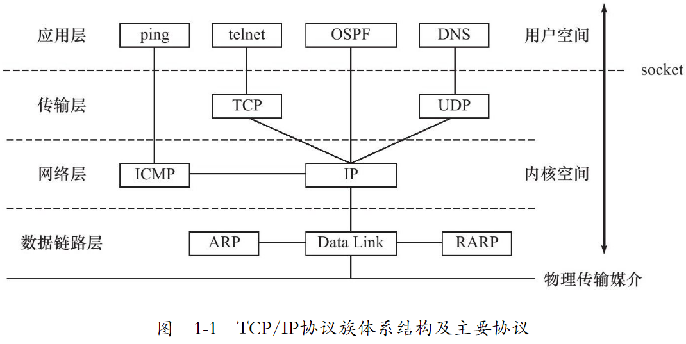
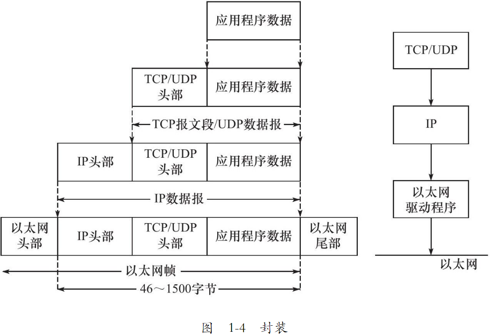
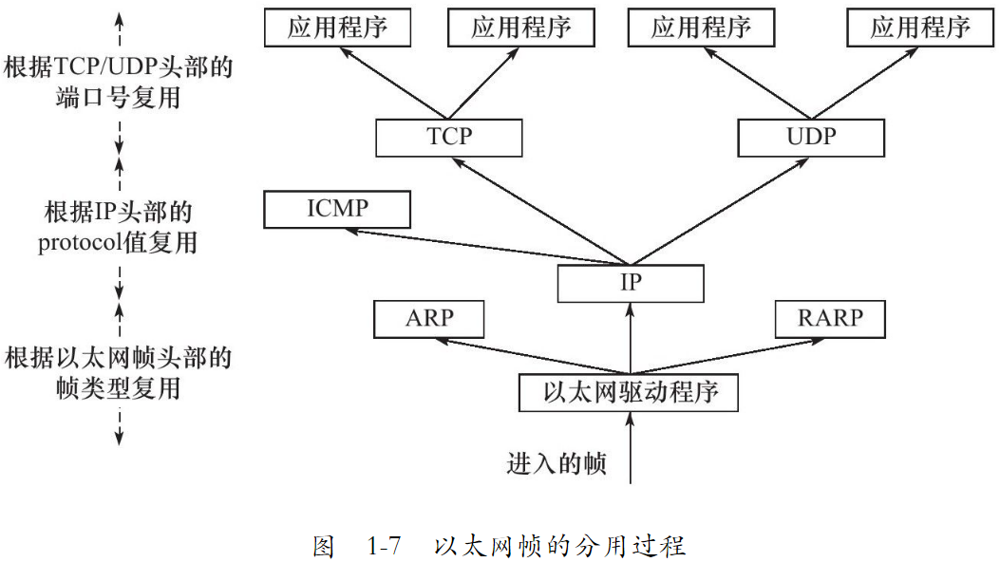
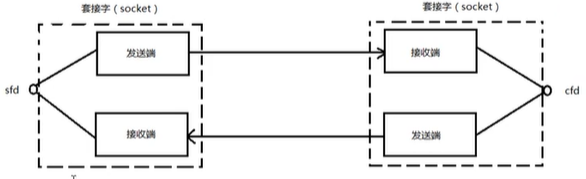
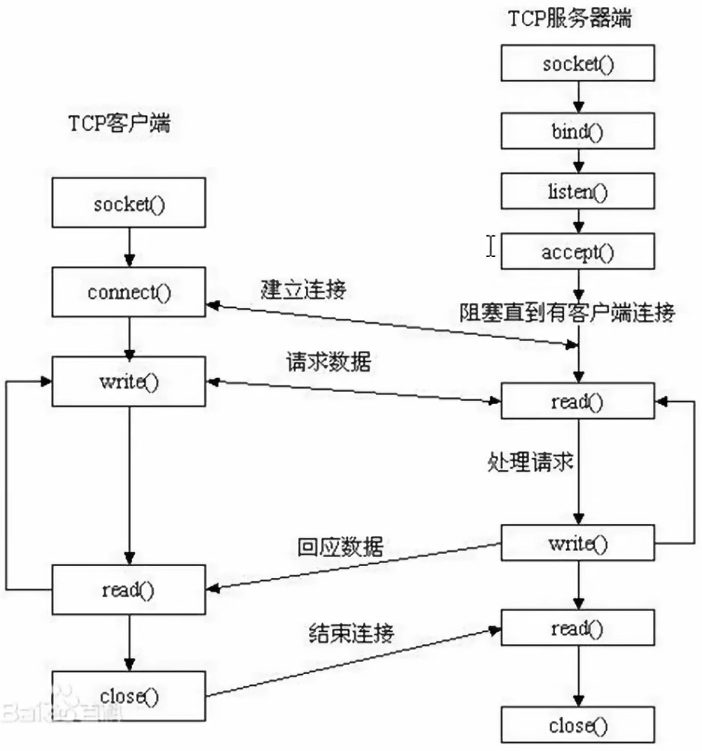
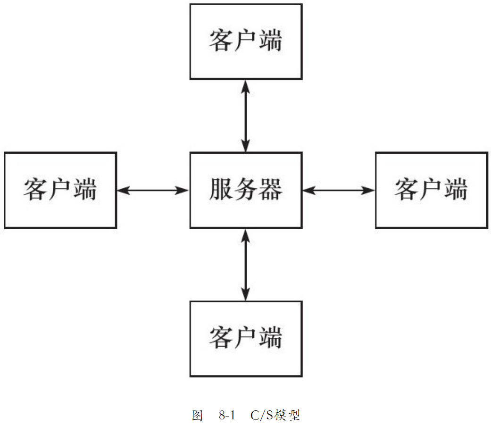
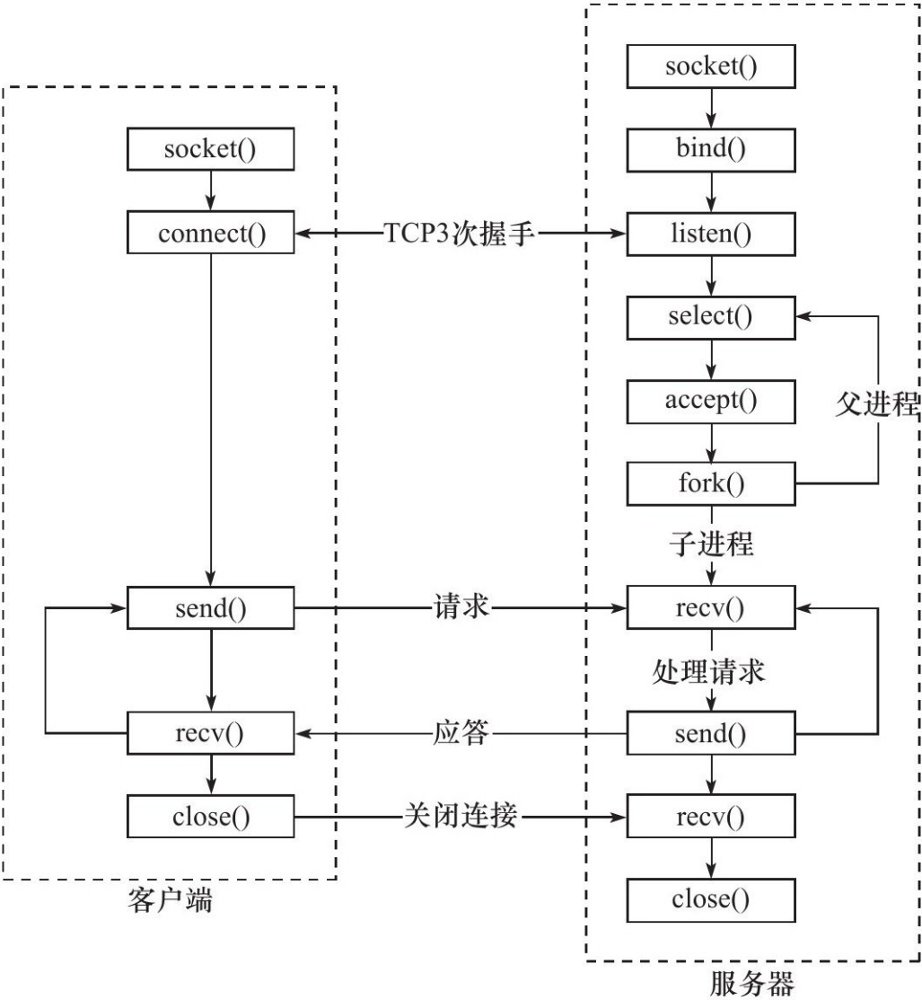
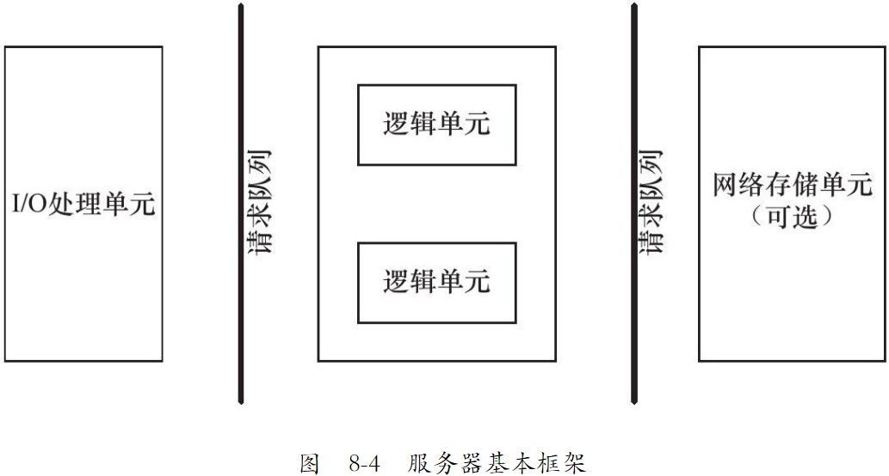
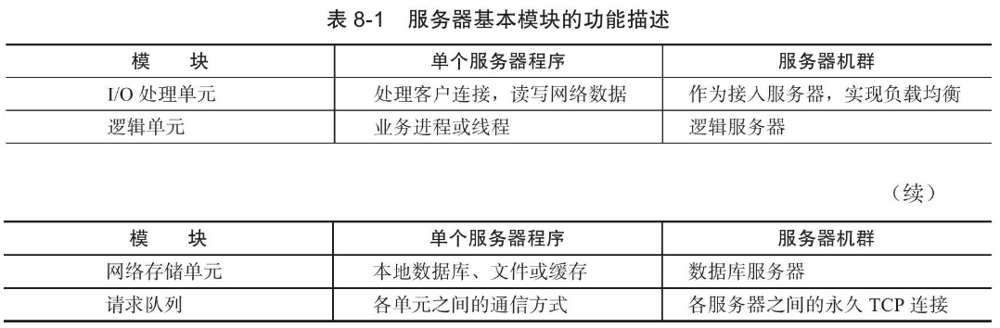

# TCP/IP 协议详解

## 1 TCP/IP 协议族

### 1.1 TCP/IP 协议族体系结构以及主要协议



#### 1.1.1 数据链路层

#### 1.1.2 网络层

#### 1.1.3 传输层

#### 1.1.4 应用层

### 1.2 封装

上层协议如何使用下层协议提供的服务呢？通过封装实现。应用程序数据在发送到物理网络上之前，将沿着协议栈从上网下依次传递。每层协议都将在上层数据的基础上加上自己的头部信息（有时还包括尾部信息），以实现该层的功能，这个过程就叫做封装。



### 1.3 分用

当帧达到目的主机时，将沿着协议栈自底向上依次传递。各层协议依次处理帧中本层负责的头部数据，以获取所需的信息，并最终将处理后的帧交给目标应用程序。这个过程称为分用。分用是靠头部信息中的类型字段实现的。



### 1.4 测试网络

### 1.5 ARP 协议工作原理

### 1.6 DNS 协议工作原理

### 1.7 socket 和 TCP/IP 协议族的关系

数据链路层，网络层，传输层协议是在内核中实现的。因此操作系统需要实现一组系统调用，使得应用程序能够访问这些协议提供的服务。实现这组系统调用的 API 就是就是 socket。

由 socket 定义的这一组 API 提供两点功能：一是将应用程序数据从用户缓冲区中复制到 TCP/UDP 内核发送缓冲区，以交付内核来发送数据，或者是从内核 TCP/UDP 接收缓冲区中复制数据到用户缓冲区，以读取数据。二是应用程序可以通过它们来修改内核中各层协议的某些头部信息或其他数据结构，从而精细地控制底层通信的行为。比如可以通过 setsocket 函数来设置 IP 数据报在网络上的存活时间。

## 2 IP 协议详解

## 3 TCP 协议详解

## 4 TCP/IP 通信案例：访问 Internet 上的 Web 服务器

Web客户端和服务器之间使用HTTP协议通信。HTTP协议的内容相当广泛，涵盖了网络应用层协议需要考虑的诸多方面。因此，学习HTTP协议对应用层协议设计将大有裨益。

### 2.1 套接字概念

在通信过程中，套接字一定是成对出现的。一端的发送缓冲区对应另一端的接收缓冲区。使用同一个文件描述符指向一个套接字（该套接字内部由内核建立的发送缓冲区和接收缓冲区实现）




### 2.2 预备知识

#### 2.2.1 网络字节序

大小端的区别

小端法：主机存储，高位高地址，地位存低地址， int a = 0x12345678

大端法：网络存储，高位存低地址，地位存高地址。

因此需要网络字节序和主机字节序的转换

htonl --> 本地转网络 争对网络（IP）

htos --> 本地转网络 针对 端口

ntohl --> 网络转本地 争对网络（IP）

ntohs --> 网络转本地 针对端口


#### 2.2.2 IP地址转换函数

上面的转换太麻烦，于是有

#include <arpa/inet.h>

本地转网络

```c
   int inet_pton(int af, const char *src, void *dst);
```
网络转本地

```c
const char *inet_ntop(int af, const void *src, char *dst, socklen_t size);
```

#### 2.2.3 sockaddr 数据

sockaddr 地址结构，缺陷是 sa_data 把目标地址和端口信息混在一起了

struct sockaddr {       

​			sa_family_t sin_family;     *//地址族* 　  

​			char sa_data[14];            *//14字节，包含套接字中的目标地址和端口信息*                　 

​					}; 

struct sockaddr_in addr;

```c
struct sockaddr_in
  {
   	sa_family_t sin_family		// 地址簇 
    in_port_t sin_port;          /* Port number. 16 位端口号 */
    struct in_addr sin_addr;      /* Internet address. 32 位 ip 地址 */

    /* Pad to size of `struct sockaddr'.  */
    unsigned char sin_zero[sizeof (struct sockaddr) -
            __SOCKADDR_COMMON_SIZE -
            sizeof (in_port_t) -
            sizeof (struct in_addr)];
  };
```

addr.sin_family = AF_INET/AF_INET6

addr.sin_port = htons(8888)

int dst

addr.sin_addr.s_addr =  inet_pton(AF_INET, "192.168.1.188", (void *)&dst)

bind(fd, (struct sockaddr *)&addr, size);

sockaddr 常用于 bind, connect, recvfrom, sendto 等函数的参数，指明地址信息，是一种通用的套接字地址。

sockaddr_in 是 internet 环境下的套接字的地址形式。所以在网络编程中我们会对 sockaddr_in 结构体进行操作，使用 sockaddr_in 来建立所需要的信息，最后使用类型转换就可以了。一般先把 sockaddr_in 变量赋值后，强制类型转换后传入 sockaddr 做参数的函数。sockaddr_in 用于 socket 的定义和赋值，sockaddr 用于函数参数。

```c
// set local address info
sock_addr.sin_family = AF_INET;
sock_addr.sin_port = htons(port);  // 本地字节序转网络字节序，16位 所以为 htons ,s 表示 short
sock_addr.sin_addr.s_addr = htonl(INADDR_ANY);    //
```

INADDR_ANY 转换过来就是0.0.0.0，泛指本机的意思，也就是表示本机的所有IP，因为有些机子不止一块网卡，多网卡的情况下，这个就表示所有网卡ip地址的意思。比如一台电脑有3块网卡，分别连接三个网络，那么这台电脑就有3个ip地址了，如果某个应用程序需要监听某个端口，那他要监听哪个网卡地址的端口呢？

如果绑定某个具体的ip地址，你只能监听你所设置的ip地址所在的网卡的端口，其它两块网卡无法监听端口，如果我需要三个网卡都监听，那就需要绑定3个ip，也就等于需要管理3个套接字进行数据交换，这样岂不是很繁琐？

所以出现INADDR_ANY，你只需绑定INADDR_ANY，管理一个套接字就行，不管数据是从哪个网卡过来的，只要是绑定的端口号过来的数据，都可以接收到。

### 2.3 网络套接字函数



socket建立过程需要三个套接字，服务端有两个，还有一个用于监听。


#### 2.3.1 socket

#include <sys/socket.h>

int socket(int domain, int type, int protocol);

详见 man 2 socket

##### 参数

-   domain 选择用来通信的协议簇
    -   AF_INET：ipv4
    -   AF_INET6：ipv6
    -    AF_UNIX: 本地通信
-   type 指定通信语义，常用的如下：
    -   SOCK_STREAM：提供顺序的、可靠的、双向的、基于连接的字节流。可能支持带外数据传输机制。就是 tcp
    -   SOCK_DGRAM：支持数据报(固定最大长度的无连接、不可靠的消息)。就是 udp
-   protocol: 指定与套接字一起使用的特定协议。通常，在给定的协议族中，只有一个协议支持特定的套接字类型，在这种情况下，值设定为 0。

##### 返回值

新套接字对应的文件描述符，失败是 -1 并设置 errno。

#### 2.3.2 setsockopt/getsockopt

设置或获取 sockets 选项

#include <sys/types.h>          /* See NOTES */
       #include <sys/socket.h>

```c
   int getsockopt(int sockfd, int level, int optname,
                  void *optval, socklen_t *optlen);
   int setsockopt(int sockfd, int level, int optname,
                  const void *optval, socklen_t optlen);
```

setsockopt() 函数，用于任意类型、任意状态套接字的设置选项值。尽管在不同协议层上存在选项，但本函数仅定义了最高的“套接口”层次上的选项。

#### 2.3.3 bind

给 socket 绑定一个 ip 加端口号（也就是一个地址结构）

int bind( int sockfd, const struct sockaddr *addr, socklent_t addrlen);

-   sockfd: socket 函数返回值
-   struct sockaddr_In addr;传入参数
-   addr.sin_family = AF_INET
-   addr.sinport = htons(8888);
-   addr.sin_addr.s_addr = htol(INADDR_ANY);
-   addr : (struct sockaddr *)&addr
-   addrlen: sizeof(addr) 地址结构大小

成功为 0，失败是 -1 并返回 errno

#### 2.3.4 listen

int listen(int sockfd, int backlog);

设置同时与服务器建立连接的上限数。（同时进行三次握手的客户端数量）

sockfd: socket 函数返回值

backlog： 上限数值。最大值为 128

成功为 0，失败是 -1 并返回 errno

不阻塞监听

#### 2.3.5 accept

int accept(int sockfd, struct sockaddr *addr, socklen_t *addrlen); 阻塞等待客户端建立连接，成功的话，返回一个与客户端成功连接的socket 文件描述符

sockfd: socket 函数返回值

addr: 传出参数，成功与服务器建立连接的那个客户端的地址结构（ip + port）

addrlen: 传入传出。入：addr 的大小。出： 客户端 addr 的实际大小

返回值： 

-   能与服务器进行通信的 socket 的文件描述符（如果成功），失败 -1 并返回设置 errno

#### 2.3.6 connect

int connect( int sockfd, const struct sockaddr *addr, socklen_t addrlen); 使用现有的 sockfd 与服务器建立连接

sockfd : 客户端调用 socket 函数的返回值

addr 传入参数：服务器的地址结构

addrlen: 服务器地址结构的长度

成功为 0，失败是 -1 并返回 errno

如果不使用 bind 绑定客户端地址结构，采用“隐式绑定”。

TCP 通信流程分析

server

1.  socket() 				创建 socket
2.  bind()                     绑定服务器地址结构
3.  listen()                   设定监听上限
4.  accept()                 阻塞监听客户端连接
5.  read(fd)                 读 socket 获取客户端数据
6.  操作，对数据进行操作
7.  write(fd)
8.  close(fd)

client

1.  socket()                 创建 socket
2.  connect()               与服务器建立连接
3.  write()                    写数据到 socket
4.  read()                     读取服务器的数据
5.  操作，操作服务器的数据
6.  close(fd);

#### 2.3.7 send, sendto, sendmsg

通过 socket 发送信息到另一个 socket

#include <sys/types.h>
       #include <sys/socket.h>

```c
   ssize_t send(int sockfd, const void *buf, size_t len, int flags);

   ssize_t sendto(int sockfd, const void *buf, size_t len, int flags,
                  const struct sockaddr *dest_addr, socklen_t addrlen);

   ssize_t sendmsg(int sockfd, const struct msghdr *msg, int flags);
```

send 函数 socket 需要已经建立连接

#### 2.3.8 recv, recvfrom, recvmsg

通过 socket 接收信息

#include <sys/types.h>
       #include <sys/socket.h>

```c
   ssize_t recv(int sockfd, void *buf, size_t len, int flags);

   ssize_t recvfrom(int sockfd, void *buf, size_t len, int flags,
                    struct sockaddr *src_addr, socklen_t *addrlen);

   ssize_t recvmsg(int sockfd, struct msghdr *msg, int flags);
```


### 2.4 C/S 模型-TCP

#### client

#### server

### 2.5 出错处理函数

#### wrap.c

#### wrap.h

# 深入解析高性能服务器编程

## 5 Linux 网络编程基础 API

Linux 网络 API 主要分为三个部分

-   socket 地址 api。socket 最开始的含义是一个 ip 地址和端口对（ip，port）。它唯一地表示了使用 tcp 通信的一款。将其称为 socket 地址
-   socket 基础 api。定义在 sys/socket.h 头文件中，包括创建 socket，命名 socket，监听 socket，接受连接，发起连接，读写数据，获取地址信息，检测带外标记，以及读取和设置 socket 选项。
-   网络信息 api。linux 提供了一套网络信息 api，以实现主机名和 ip 地址之间的转换，以及服务名称和端口号之间的转换。api 定义在 netdb.h 头文件中。

### 5.1 socket 地址 api

#### 5.1.1 主机字节序和网络字节序


## 7 linux 服务器程序规范

## 8 高性能服务器程序框架

按照服务器程序的一般原理，将服务器解构为如下三个主要模块：

❑I/O 处理单元。本章将介绍 I/O 处理单元的四种 I/O 模型和两种高效事件处理模式。

❑逻辑单元。本章将介绍逻辑单元的两种高效并发模式，以及高效的逻辑处理方式——有限状态机。

❑存储单元。本书不讨论存储单元，因为它只是服务器程序的可选模块，而且其内容与网络编程本身无关。

### 8.1 服务器模型

#### 8.1.1 C/S 模型

Tcp/ip 协议在设计和实现上并没有客户端和服务器的概念，在通信过程中所有的机器都是对等的。但由于资源（视频，新闻，软件等）都被数据提供者垄断，所以几乎所有的网络应用程序都采用 C/S 模型。所有的客户端都通过访问服务端来获取所需的资源



c/s 模型的逻辑很简单。服务器启动后，首先创建一个（或多个）监听 socket，并调用 bind 函数将其绑定到服务器感兴趣的端口上，然后调用 listen 函数等待客户连接。服务器稳定运行后，客户端就可以调用 connect 函数向服务器发起连接了。**由于客户连接请求是随即到达的异步事件，服务器需要使用某种 I/O 模型来监听这一事件**。I/O 模型由多种，下图中使用的 I/O 复用技术之一的 select 系统调用。当监听到连接请求后，服务器就调用 accept 函数来接受它，并分配一个逻辑单元为新的连接服务。逻辑单元可以是新创建的子进程，子线程或者其他。



c/s 模型非常适合资源相对集中的场合，并且它的实现也简单，但其缺点很明显：服务器是通信的中心，当访问量过大时，可能所有的客户都将得到很慢的响应。

### 8.2 服务器编程框架

虽然服务器程序种类繁多，但其基本框架都一样，不同之处在于逻辑处理。



上图既能用来描述一台服务器，也能用来描述一个服务器机群。两种情况下各个部件的含义和功能列表如下所示：



I/O 处理单元是服务器管理客户连接的模块。它通常完成以下工作：等待并接受新的客户连接，接收客户数据，将服务器响应数据返回给客户端。**但是，数据的收发不一定在 I/O 处理单元中执行，也可能在逻辑单元中执行，具体在何处执行取决于事件处理模式**。对于一个服务器机群来说，I/O 处理单元是一个专门的接入服务器。它实现负载均衡，从所有的逻辑服务器中选取负荷最小的一台来为新客户服务。

一个逻辑单元通常是一个进程或一个线程。它分析并处理客户数据，然后将结果传递给 I/O 处理单元或者直接发送给客户端（具体使用哪种方式取决于事件处理模式）。对服务器机群而言，一个逻辑处理单元本身就是一台逻辑服务器。服务器通常拥有多个逻辑单元，以实现对多个客户任务的并行处理。

网络存储单元可以是数据库，缓存和文件，甚至是一台独立的服务器。但它不是必须的，比如 ssh，telnet 等登录服务就不需要这个单元。

请求队列是各单元之间的通信方式的抽象。I/O 处理单元接收到客户请求时，需要以某种方式通知一个逻辑单元来处理该请求。同样，多个逻辑单元同时访问一个存储单元时，也需要采用某种机制来协调处理竞态条件。请求队列通常被实现为池的一部分。对于服务器机群而言，请求队列时各台服务器之间预先建立的，静态的，永久的 TCP 连接。这种 TCP 连接能提高服务器之间交换数据的效率，因为它避免了动态建立 TCP 连接导致的额外的系统开销。

### 8.3 I/O 模型

